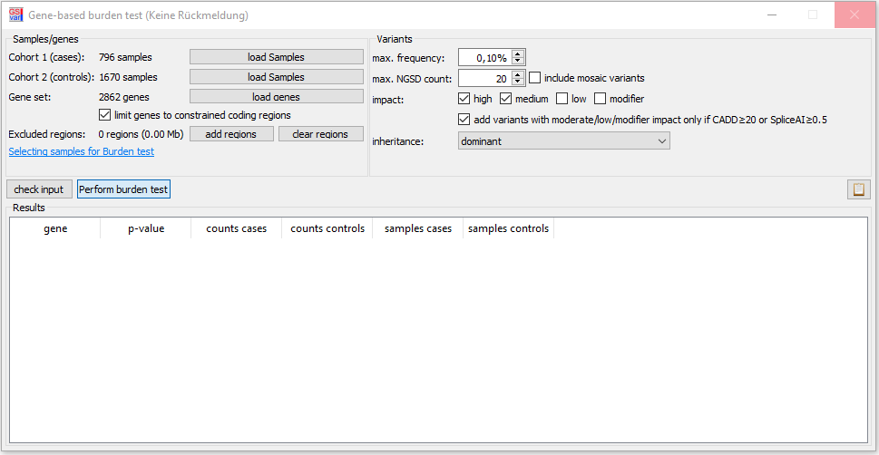

# Burden test

## Basics

Using the gene-based burden test you can check if a gene might be causal for a disease.  
You provide a list of cases, controls and genes.  
For each gene a p-value is calculated that indicates if the gene might be causal for the disease of the cases.

The burden test dialog can be found in the GSvar main menu:  
`NGSD > Genes > Gene-based burden test`

## Selecting case samples

The samples of the case cohort should fulfill the following criteria:

- unsolved samples of a certain disease
- no samples with bad quality
- all samples have the same ancestry (EUR if possible, since that is 90% of our data)
- all samples should be unrelated
- all samples have the same processing system (WGS if possible, since it has the least biases)

## Selecting control samples

The samples of the control cohort should fulfill the following criteria:

- not of the same disease as the controls (also no similar phenotype)
- no samples with bad quality
- same ancestry as cases
- all samples should be unrelated
- same processing system as cases

## Selecting genes

The burden test is very time consuming because all variants of a lot of samples need to be queried for the NGSD.  
Thus, it is not possible to perform the burden test for all genes.  
Please select not more than 200 genes unless you want to wait for a very long time

## Running the burden test

After entering cases, controls and genes, you have to specify which variants should be included into the test. You can also add a region which should be excluded (e.g. low confident regions).  
Then you can run the test and copy the results to the clipboard:

--

[back to main page](index.md)
