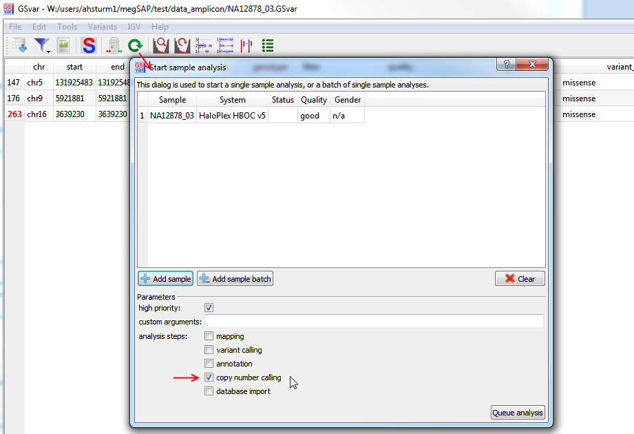
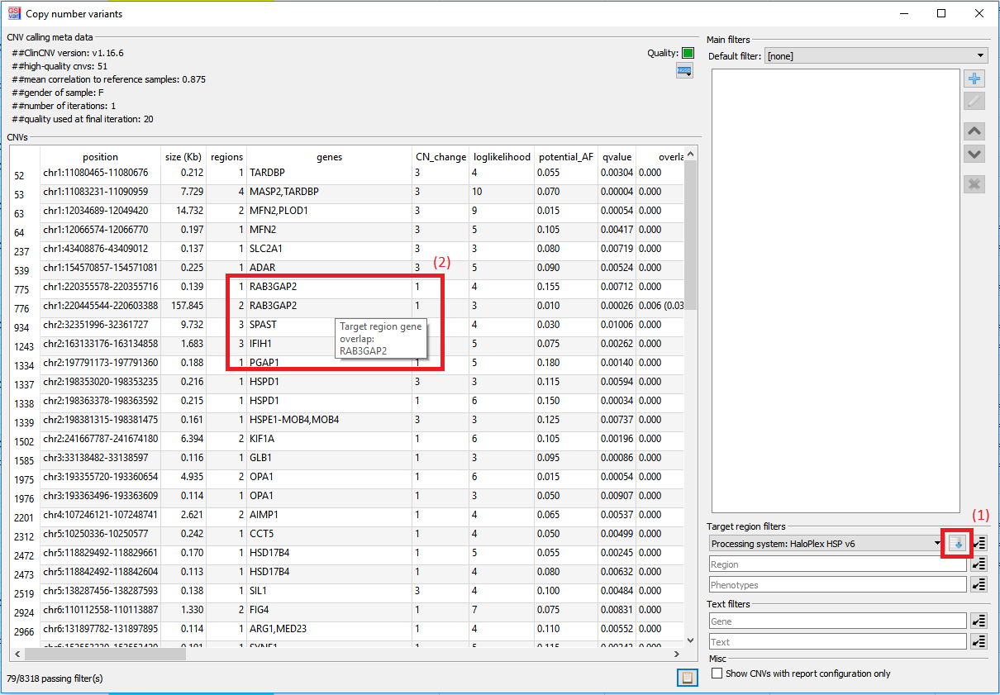

## CNV analysis

Copy-number variant (CNV) calling is performed based on the depth of coverage, i.e. the number of reads, in a defined region.  
For exome or panel sequencing, a region is typically an exon. For genome sequencing, a region is defined as a slice of the genome with a defined size, e.g. 1000 bases.

### General CNV analysis strategy

The analysis strategy for CNVs depends on inheritance mode and other factors.  
These are examples of analysis steps that are commonly performed:

1. Check for **compound heterozygous** variants: CNV/CNV und CNV/SNV
	
	**Note:** For the analysis of compound heterozygous CNV and SNVs, the filtering of the small variants is relevent: use the `dominant_relaxed` filter.

1. Check for **homozygous deletions** using the `copy number=0` filter
1. Check for **microdeletion syndromes** using `min regions=10` filter
1. Check for CNVs matching the **patient phenotype** (`target region` and/or `phenotypes` filter)
1. Check for CNVs in **ACMG** target-region

### CNV analysis details

Two different algorithms are used for CNV calling, depending on the sequencing strategy.  
For exome and genome sequencing data, [ClinCNV](https://github.com/imgag/ClinCNV) is used for copy-number analysis.  
For panel sequencing data, [CnvHunter](https://github.com/imgag/ngs-bits/) is used.

For detailed information, please have a look a the algorithm-specific sections:

- [ClinCNV](cnv_analysis_clincnv.md)

## FAQ

### How do I re-start the CNV analysis of a sample

Copy-number variant calling is based on a virtual reference sample, which is constructed of the most similar samples with the same processing system.  
The more samples there are, the more accurate the CNV analysis will be.

Thus, re-analyzing copy-number variants when more reference samples are sequenced is a common task. It can be performed using the sample details dock widget:

### How do I get the genes of a CNV which overlaps the selected target region

Requirements: To calculate the overlap between the CNVs and the selected target region you need to have access to the NGSD and a gene file containing all genes of the target region (named `..._genes.txt`) at the same location as the target region file. 

After a target region is selected and a gene file is available you can click on the button right next to the drop-down menu of the target region (1). Since the computation can take some time (depending on the size of the target region) this has to be done manually every time the target region is changed. As soon as the computation is finished you can hover over the "`genes`" column to see the genes of the target region in a tool tip (2).

--

[back to main page](index.md)
