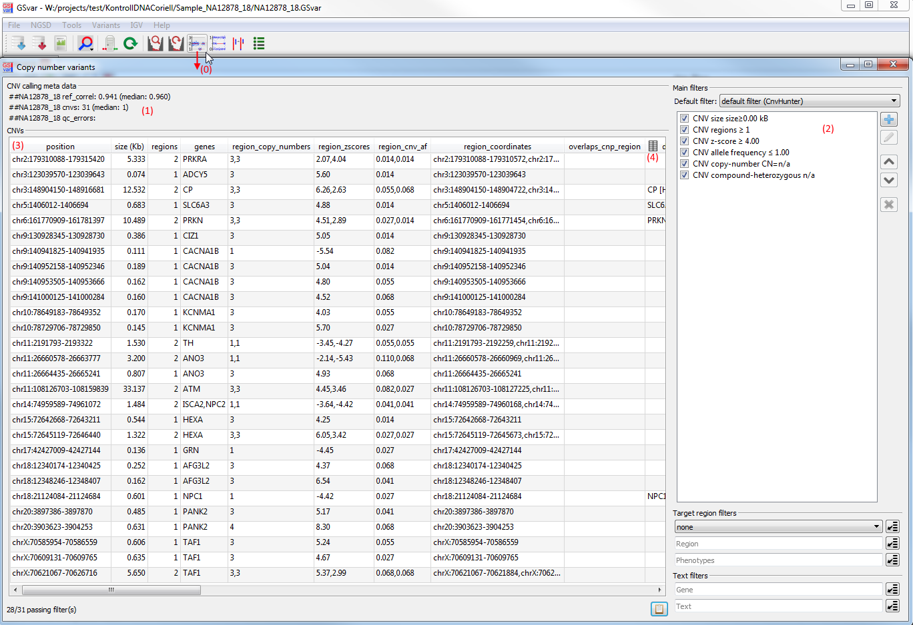
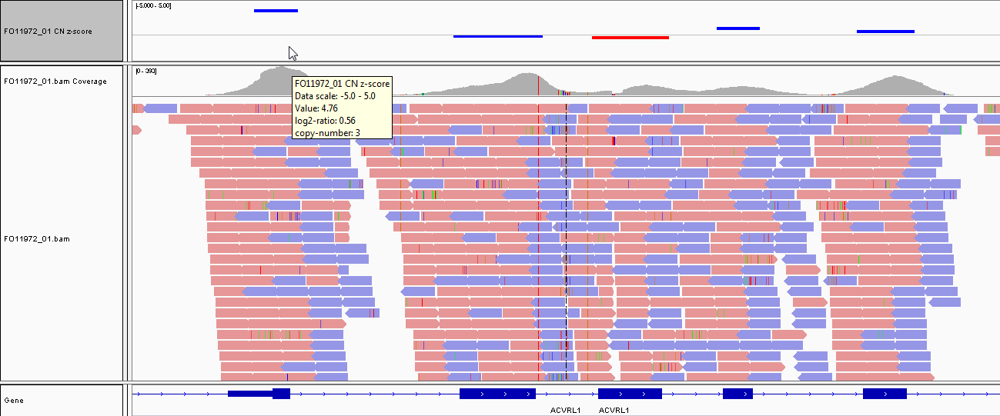

##CNV analysis

Copy-number variant (CNV) calling is performed using the [CnvHunter](https://github.com/imgag/ngs-bits/) tool.

CnvHunter is designed for targeted NGS sequencing, where exon target regions alternate with non-target intron regions. Thus, a single copy-number variant can consist of several subsequent regions (i.e. exons). For each region, the copy-number state and the [z-score](https://en.wikipedia.org/wiki/Standard_score) indicating the significance are listed (see screenshot in the 'CNV filtering' section).

###Re-analyzing a sample

Copy-number variant calling is based on a virtual reference sample, which is constructed of the 20 most similar samples with the same processing system. Thus, at least 20 samples of the sample processing system are needed to perform the CNV analysis. The more samples there are, the more accurate the CNV analysis will be.

Thus, re-analyzing copy-number variants when more reference samples are sequenced is a common task. It can be performed using the sample information dialog:

###CNV analysis quality

Visualization and filtering of CNVs is done in the "Copy-number variants" dialog, which is shown below.
The dialog is opened from the main tool bar (0). 

In the upper part of the dialog (1), sample-specific information about the CNV calling is shown. It gives an impression  of the sample quality:

* Reference sample correlation (and mean reference sample correlation of all samples)
* Number of CNVs detected (and mean number of CNVs for all samples)
* QC errors: If CNV calling was skipped because of QC problems, the reason is shown here. Common problems are:
	* Low reference sample correlation (indicated by 'corr' entry)
	* Low average depth on the target region (indicated by 'avg_depth' entry)

###CNV filtering

Above the CNV list, there are several options for filtering CNVs (2):

* size
* number of regions
* copy-number state
* target region (if set in the main filter panel for variants)
* genes (if set in the main filter panel for variants)

For each CNV the following stats are shown (3):

* genomic position
* affected genes (if they are annotated)
* size
* region count
* copy-number state (one per region)
* z-score (one per region)

###Visualizing copy-number data in IGV

*Double-clicking* a CNV in the dialog, opens the CNV region in IGV (see also section [IGV integration](igv_integration.md)).

If the sample folder contains a SEG file, this file can be shown as CNV track in IGV. The default visualization is in heatmap style. In this style regions with a non-significant z-score between -2.5 and 2.5 and regions for which no CNV calling could be performed are shown in white. Gains (z-score>2.5) are shown in red and losses (z-score<-2.5) are shown in blue. Grey areas indicate regions that are not part of the target region (i.e. introns and intergenic regions).

In addition to the z-score which is vizualized, the CNV track also contains the log2-ratio and copy-number, which are shown as a tooltip when hovering over a region (see screenshot).

The scale of the heatmap can be changed using the context menu of the track. Besides the heatmap vizualization, several other visualizations (points, bars, lines) can be selected in the context menu, which might be more informative depending on the use-case.

--
[back to main page](index.md)

