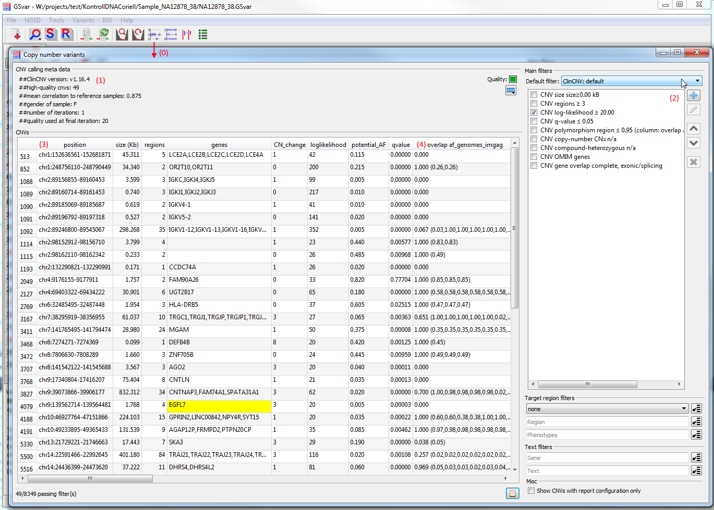
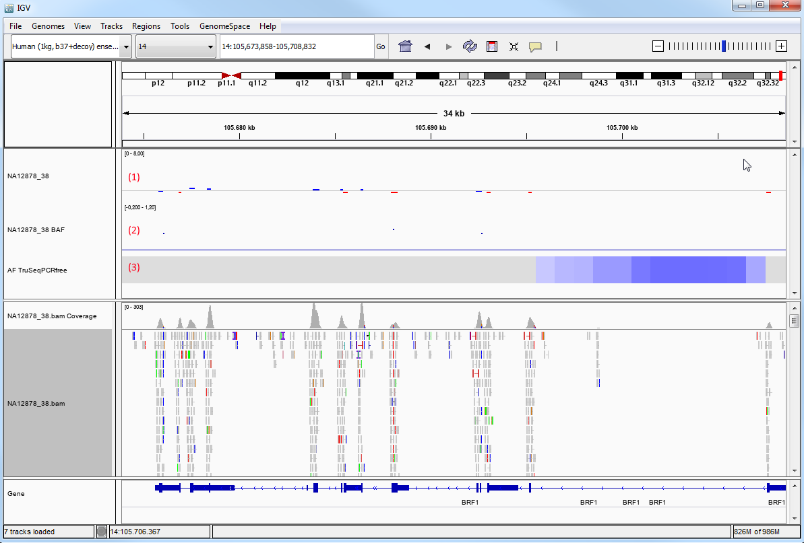
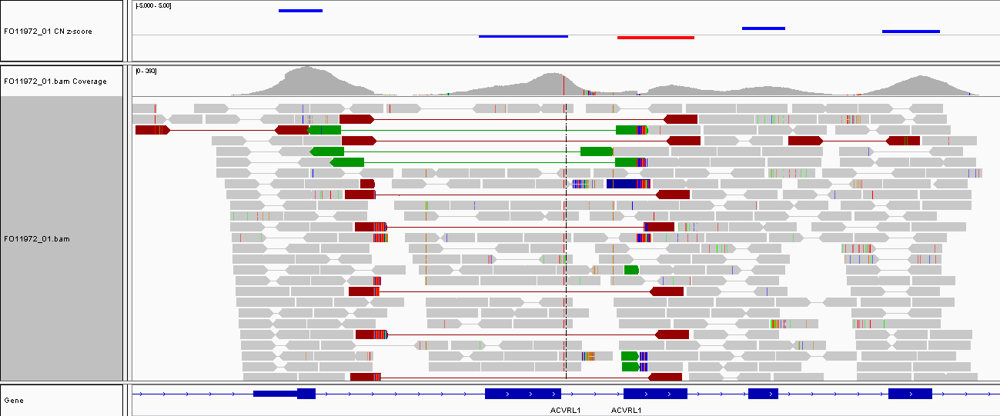

## CNV analysis

Copy-number variant (CNV) calling is performed based on the depth of coverage, i.e. the number of reads or the average depth in a region.  
For exome or panel sequencing, a region is typically a exon.  
For genome sequencing, the genome is sliced into regions of a defined size, e.g. bins of 1000 bases.

To find CNVs, the depth of coverage for each region of the analyzed sample is compared to the depth of in a set of reference samples. Outliers are putative CNVs.  
This approach based on reference samples has one drawback: only regions that normally have a copy-number of 2 can be reliably analyzed. Regions that are part of frequent copy-number polymorphisms (CNPs) cannot be analyzed this way. For rare disease, this should however not matter much, since here we are searching for rare CNVs.

### General CNV analysis strategy

The analysis strategy for CNVs depends on inheritance mode and other factors.  
These are examples of analysis steps that are commonly performed:

1. Check for **compound heterozygous** variants: CNV/CNV und CNV/SNV
	
	**Note:** For the analysis of compound heterozygous CNV and SNVs, the filtering of the small variants is relevent: use the `dominant_relaxed` filter.

1. Check for **homozygous deletions** using the `copy number=0` filter
1. Check for **microdeletion syndromes** using `min regions=10` filter
1. Check for CNVs matching the **patient phenotype** (`target region` and/or `phenotypes` filter)
1. Check for CNVs in **ACMG** target-region

## CNV analysis using ClinCNV

ClinCNV is a copy-number calling algorithm, which is based on the depth of coverage of adjacent regions.  
In exome/panel sequencing, exon target regions alternate with non-target intron regions.  
In genome sequencing, a region is defined as a 1000 bases windows of the genomes.

For each region, the expected depth of coveraged for the reference samples is compared with the observed depth of coverage.  
A log-likelihood of a copy-number alteration is given for each region. 

### CNV analysis quality

Visualization and filtering of CNVs is done in the "Copy-number variants" dialog, which is shown below.
The dialog is opened from the main tool bar (0). 

In the upper part of the dialog (1), sample-specific information about the CNV calling is shown.  
It gives an impression  of the sample quality:

* *number of high-quality CNVs* - high-quality means above log-likelihood 20 (see below for expected numbers).
* *gender of sample* - gender determined from the depth of coverage data during the CNV calling.
* *number of iterations:* If more CNVs than expected are encountered for a sample, the algorithm sensitivity is decreased and the algorithm is re-applied until a reasonable number of CNVs is called. The number of iterations counts how often the algorithm was started. Normally, this should be 1. A higher number idicates a problem during the analysis of the sample.
* *mean correlation to reference samples:* Since that CNV analysis is based on reference samples, the similarity of the depgh of coverage data is very important. This metric shows how good the sample fits to the reference samples. If the correlation is low, there might be a problem with the CNV analysis.

The distribution of the above metrics can be plotted using the NGSD menu on the right of the meta data section.

### CNV filtering

On the right side, default filters can be selected and modified (2).
For each CNV the following properties are shown (3):

* genomic position
* size (kB)
* number of regions (exons for WES/bins for WGS)
* affected genes
* copy-number change
* log-likelihood: logarithm of the ratio between likelihoods of the *no CN change model* vs the *CN equal to the reported state model* (bigger is better)
* potential AF: frequency of the copy-number change in the analyzed cohort, i.e. the 100-200 most similar samples *(Note: this can deviate from the population allele frequency, especially for rare CNVs)*
* q-value: p-value corrected for the number of CNVs detected. Below 0.05 for high quality CNVs. If higher than 0.05 the CNV call might be false-postive (CNP region, repeat region, ...). 

Additionally, generic annotation columns are added (4), e.g.:

* overlap af_genomes_imgag: overlap with copy-number-polymorphism (CNP) region determined from IMGAG in-house genomes. CNPs are regions where more than 2% or samples deviate from the expected copy number. 
    * The first number is the fraction of overlap between CNP region and CNV in questions. The range is 0 (no overlap) to 1 (complete overlap).
    * The number in brackets is the allele-frequency of the CNP, i.e. the fraction of samples with CN not equal to the expected copy number. If several CNP regions overlap with the CNV, several AFs are listed as a comma-sparated list.
        * These numbers are calculated from the `AF TruSeqPCRfree` track described below.
* cn_pathogenic: in-house database of pathogenic CNVs
* dosage_sensitive_disease_genes: dosage-sensitive disease genes (from [ClinGen Dosage Sensitivity Map](https://www.ncbi.nlm.nih.gov/projects/dbvar/clingen/))
* clinvar_cnvs: overlapping (likely-)pathogenic CNVs in ClinVar
* hgmd_cnvs: overlapping (likely-)pathogenic CNVs in HGMD
* OMIM genes
* gene_info: gene-specific information from NGSD
	* gnomAD o/e score for LOF variants
	* overlap with gene (complete, intronic/intergenic, exonic/splicing)
* ngsd_pathogenic_cnvs: overlap with known pathogenic CNVs from NGSD
	* Contains a list with all known pathogenic CNVs from the NGSD which overlaps with the current CNV
	* The first value of each entry defines the class of the overlapping CNV (4 or 5)
	* The second value is the fraction of the pathogenic CNV that overlaps the annotated CNV. Range: from 0 (no overlap) to 1 (complete overlap).

More information about a copy-number variant can be found through the resources linked in the context menu.  

**Note:**  
Columns marked with a table symbol can contain a lot of information in each cell.  
To make them readable, they can be displayed as a table by double-clicking the cell.  
In this details table, the first column contains the database identifier of the entry.
If the database identifier is marked with a link symbol, it be double-clicked to open the source database page.

### Number of CNVs to expect

To allow very sensitive CNV detection, we use a very low log-likelihood cutoff of 3 and call down to one exon/region when executing ClinCNV.  
However, by default GSvar only shows CNVs with a more conservative log-likelihood of 20 or higher.  
To increase sensitivity, the user can lower the log-likelihood cutoff.

However, when lowering the cutoff, the number of CNVs increases dramatically.  
Thus, low cutoffs should only be used when looking at specific regions of interest, e.g. a single gene that matches the phenotype of the patient.

The following table shows the expected number of CNVs for exomes/genomes using different log-likelihood cutoffs:

<table>
	<tr><th>log-likelihood cutoff</th><th>exome</th><th>genome</th></tr>
	<tr><td>3</td><td>500-2500</td><td>3000-5000</td></tr>
	<tr><td>10</td><td>150-350</td><td>1400-2100</td></tr>
	<tr><td>20</td><td>50-120</td><td>800-1400</td></tr>
	<tr><td>40</td><td>20-70</td><td>500-800</td></tr>
	<tr><td>100</td><td>&lt;40</td><td>&lt;500</td></tr>
</table>

**Note:** The CNV numbers listed above include CNVs down to one exon/region.  
When increasing the required number of subsequent regions, e.g. to 3, the number of CNVs is reduced significantly!

### Visualizing copy-number data in IGV

*Double-clicking* a CNV in the dialog, opens the CNV region in IGV (see also section [IGV integration](igv_integration.md)).

Usually, three tracks are shown that help you interprete the CNV (see the screenshot below):

* copy number track (1): The copy-number estimates for each region (exon/bin) are shown. Gains are displayed in blue and losses are displayed in red. When hovering over a region, the variance in the reference cohort is also shown. Target regions in which no calling could be performed are assigned copy-number -0.001 and one of these error codes:
	* LowRawCoverage: Regions that are excluded because the depth is low or zero in most samples.
	* SystematicallyLowCov: Regions that are excluded because the normalized depth is not distributes around 1.
	* TooShortOrNA: Regions that are excluded because GC content could not be reliably determined, mainly regions with less than 50 bases.
	* GCnormFailed: Regions that are excluded because of extreme GC content which cannot be normalized.
* BAF track (2): b-allele-frequency of known SNPs in the sample. This track can be used to validate large deletions (no heterozygous variants, thus all BAFs should be 0 or 1) and for large heterozygous duplications (the center line of SNPs with AF 0.5 should split in two lines around 0.33 and 0.66).
* AF TruSeqPCRfree (3): This track shows the copy-number-poymorphism regions (i.e. regions in wich more than 2% of our WGS samples don't have copy-number two). Lighter blue indicates lower AF, darker blue indicates higher AF and gray means that this region is not a CNP region. When hovering over a CNP region, the copy-number distribution in our cohort is shown in brackets as count for copy-number 0, copy-nuber 1, etc. up to count for copy-number 10.

We can adapt the IGV settings of the BAM track to visualize the breakpoints created by a copy-number variant (if they lie inside the target region):

* Open perferences dialog `View > Preferences` and on the `Alignments` tab, enable `Show soft-clipped bases`.
* Right-click on the BAM track and enable `View as pairs`.
* Right-click on the BAM track and enable `Color alignments by > Insert size and pair orientation`. 

Then, it is clear that in this case there is a tandem duplication of the region from exon 1 to exon 3.

### Further reading

More details on CNV calling with ClinCNV can be found in the [ClinCNV documentation](https://github.com/imgag/ClinCNV/blob/master/doc/germline_CNV_analysis.md).

## FAQ

### How do I re-start the CNV analysis of a sample

Copy-number variant calling is based on a virtual reference sample, which is constructed of the most similar samples analyzed with the same processing system.  
The more samples there are, the more accurate the CNV analysis will be.

Thus, re-analyzing copy-number variants when more reference samples are sequenced is a common task.  

Please check the [data analysis](data_analysis.md) section for details.

### How do I get the genes of a CNV which overlaps the selected target region

Requirements: To calculate the overlap between the CNVs and the selected target region you need to have access to the NGSD and a gene file containing all genes of the target region (named `..._genes.txt`) at the same location as the target region file. 

After a target region is selected and a gene file is available you can click on the button right next to the drop-down menu of the target region (1). Since the computation can take some time (depending on the size of the target region) this has to be done manually every time the target region is changed. As soon as the computation is finished you can hover over the "`genes`" column to see the genes of the target region in a tool tip (2).

--

[back to main page](index.md)
