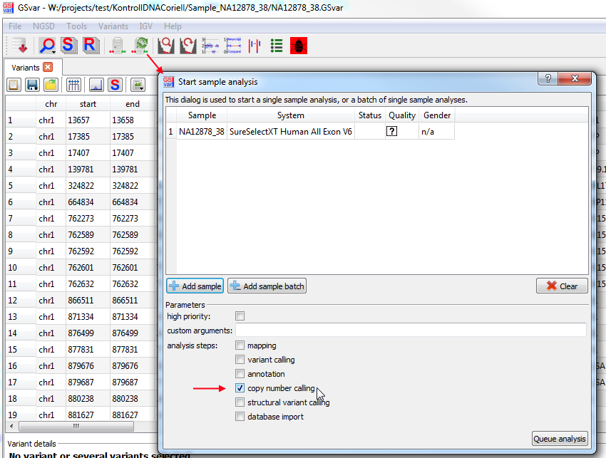

## CNV analysis

Copy-number variant (CNV) calling is performed using the [CnvHunter](https://github.com/imgag/ngs-bits/) tool.

CnvHunter is designed for targeted NGS sequencing, where exon target regions alternate with non-target intron regions. Thus, a single copy-number variant can consist of several subsequent regions (i.e. exons). For each region, the copy-number state and the [z-score](https://en.wikipedia.org/wiki/Standard_score) indicating the significance are listed (see screenshot in the 'CNV filtering' section).

### General CNV analysis strategy

The analysis strategy for CNVs depends on inheritance mode and other factors.  
These are examples of ananlysis steps that are commonly performed:

1. Check for **compound heterozygous** variants: CNV/CNV und CNV/SNV
	
	**Note:** For the analysis of compound heterozygous CNV and SNVs, the filtering of the small variants is relevent: use the `dominant_relaxed` filter.

1. Check for **homozygous deletions** using the `copy number=0` filter
1. Check for **microdeletion syndromes** using `min regions=10` filter
1. Check for CNVs matching the **patient phenotype** (`target region` and/or `phenotypes` filter)
1. Check for CNVS in **ACMG** target-region

### CNV analysis quality

Visualization and filtering of CNVs is done in the "Copy-number variants" dialog, which is shown below.
The dialog is opened from the main tool bar (0). 

In the upper part of the dialog (1), sample-specific information about the CNV calling is shown. It gives an impression  of the sample quality:

* Reference sample correlation (and mean reference sample correlation of all samples)
* Number of CNVs detected (and mean number of CNVs for all samples)
* QC errors: If CNV calling was skipped because of QC problems, the reason is shown here. Common problems are:
	* Low reference sample correlation (indicated by 'corr' entry)
	* Low average depth on the target region (indicated by 'avg_depth' entry)

### CNV filtering

Above the CNV list, there are several options for filtering CNVs (2):

* size
* number of regions
* copy-number state
* z-score
* frequency (in-house CNV frequency) 
* target region (if set in the main filter panel for variants)
* genes (if set in the main filter panel for variants)
* phenotypes (if set in the main filter panel for variants)
* text (if set in the main filter panel for variants)
* generic annotation columns

For each CNV the following properties are shown (3):

* genomic position
* affected genes (if they are annotated)
* size
* region count
* copy-number state (one per region)
* z-score (one per region)
* frequency in the analyzed dataset independent of the copy-number state (one per region)

Additionally, generic annotation columns can be added (4), e.g.:

* overlap with copy-number polymorphism region (strict copy number map from [Zarrei et. al. 2015](http://www.nature.com/nrg/journal/v16/n3/abs/nrg3871.html))
* dosage-sensitive disease genes (from [Zarrei et. al. 2015](http://www.nature.com/nrg/journal/v16/n3/abs/nrg3871.html))
* OMIM genes

More information about a copy-number variant can be found through the resources linked in the context menu (5). 

### Visualizing copy-number data in IGV

*Double-clicking* a CNV in the dialog, opens the CNV region in IGV (see also section [IGV integration](igv_integration.md)).

If the sample folder contains a SEG file, this file can be shown as CNV track in IGV. The default visualization is in points style. In this style gains (z-score>0) are shown in blue and losses (z-score<0) are shown in red.

In addition to the z-score which is vizualized, the CNV track also contains the log2-ratio and copy-number, which are shown as a tooltip when hovering over a region. In this screenshot the first exon of the ACVRL1 gene is duplicated (z-score=4.76).

We can adapt the IGV settings of the BAM track to visualize the breakpoints created by a copy-number variant (if they lie inside the target region):

* Open perferences dialog `View > Preferences` and on the `Alignments` tab, enable `Show soft-clipped bases`.
* Right-click on the BAM track and enable `View as pairs`.
* Right-click on the BAM track and enable `Color alignments by > Insert size and pair orientation`. 

Then, it is clear that in this case there is a tandem duplication of the region from exon 1 to exon 3.

## FAQ

### How do I re-start the CNV analysis of a sample

Copy-number variant calling is based on a virtual reference sample, which is constructed of the 20 most similar samples with the same processing system. Thus, at least 20 samples of the sample processing system are needed to perform the CNV analysis. The more samples there are, the more accurate the CNV analysis will be.

Thus, re-analyzing copy-number variants when more reference samples are sequenced is a common task. It can be performed using the sample details dock widget:

--

[back to main page](index.md)

