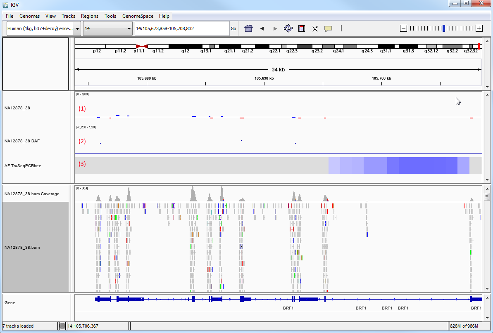

## CNV analysis for exomes/genomes 

ClinCNV is a copy-number calling algorithm designed for exome and genome sequencing, which is based on the depth of coverage of adjacent regions.  
In exome sequencing, exon target regions alternate with non-target intron regions.  
In genome sequencing, a region is defined as a 1000 bases windows of the genomes.

For each regions, the expected depth of coveraged is compared with the observed depth of coverage and a log-likelihood of a copy-number alteration is gived for each region. 

### CNV analysis quality

Visualization and filtering of CNVs is done in the "Copy-number variants" dialog, which is shown below.
The dialog is opened from the main tool bar (0). 

In the upper part of the dialog (1), sample-specific information about the CNV calling is shown. It gives an impression  of the sample quality:

* *number of iterations:* If more CNVs than expected are encountered for a sample, the algorithm sensitivity is decreased and the algorithm is re-applied until a reasonable number of CNVs is called. The number of iterations counts how often the algorithm was started. Normally, this should be 1. A higher number idicates a problem during the analysis of the sample.
* *gender of sample*
* *was it outlier after clusting:* The input samples are clustered to find sample groups with similar depth profiles. If a samples is an outlier in this initial clustering, this indicates a problem during the analysis of the sample.
* *fraction of outliers:* Fraction of regions that are outliers after normalization

### CNV filtering

Above the CNV list, there are several options for filtering CNVs (2):

* size
* number of regions
* log-likelihood
* copy-number state
* allele frequency (estimated frequency of CNV for the region in the analyzed cohort 
* target region (if set in the main filter panel for variants)
* genes (if set in the main filter panel for variants)
* phenotypes (if set in the main filter panel for variants)
* text (if set in the main filter panel for variants)
* generic annotation columns

For each CNV the following properties are shown (3):

* genomic position
* affected genes (if they are annotated)
* size
* copy-number change
* log-likelyhood: logarighm of the ratio between likelihoods of the *no CN change model* vs the *CN equal to the reported state model* (bigger is better)
* number of regions
* potential AF: frequency of the copy-number change *in the analyzed cohort (Note: this can deviate from the population allele frequency, especially for rare CNVs)*
* q-value: p-value corrected for the number of CNVS detected (smaller is better)

Additionally, generic annotation columns can be added (4), e.g.:

* overlap with copy-number polymorphism regions (as defined by [Zarrei et. al. 2015](http://www.nature.com/nrg/journal/v16/n3/abs/nrg3871.html))
* overlap with copy-number polymorphism regions (as defined by [Demidov (private communication)](TODO))
* dosage-sensitive disease genes (from [Zarrei et. al. 2015](http://www.nature.com/nrg/journal/v16/n3/abs/nrg3871.html))
* OMIM genes

More information about a copy-number variant can be found through the resources linked in the context menu (5). 

### Number of CNVs to expect

To allow very sensitive CNV detection, we use a very low log-likelihood cutoff of 3 and call down to one exon/region when executing ClinCNV.  
However, by default GSvar only shows CNVs with a more conservative log-likelyhood of 20 or higher.  
To increase sensitivity, the user can lower the log-likelyhood cutoff.

However, when lowering the cutoff, the number of CNVs increases dramatically.  
Thus, low cutoffs should only be used when looking at specific regions of interest, e.g. a single gene that matches the phenotype of the patient.

The following table shows the expected number of CNVS for exomes/genomes using different log-likelihood cutoffs:

<table>
	<tr><th>log-likelihood cutoff</th><th>exome</th><th>genome</th></tr>
	<tr><td>3</td><td>500-2500</td><td>3000-5000</td></tr>
	<tr><td>10</td><td>150-350</td><td>1400-2100</td></tr>
	<tr><td>20</td><td>50-120</td><td>800-1400</td></tr>
	<tr><td>40</td><td>20-70</td><td>500-800</td></tr>
	<tr><td>100</td><td>&lt;40</td><td>&lt;500</td></tr>
</table>

**Note:** The CNV numbers listed above include CNVs down to one exon/region.  
When increasing the required number of subsequent regions, e.g. to 3, the number of CNVs is reduced significantly!

### Visualizing copy-number data in IGV

*Double-clicking* a CNV in the dialog, opens the CNV region in IGV (see also section [IGV integration](igv_integration.md)).

If the sample folder contains a copy-number SEG file, this file can be shown as a track in IGV. The default visualization is in points style. In this style gains are shown in blue and losses are shown in red.

In addition to the log-likelihood which is vizualized, the CNV track also contains TODO, which are shown as a tooltip when hovering over a region. In this screenshot a homozygous deletion of two exons in the OR2T10 gene is shown:

We can adapt the IGV settings of the BAM track to visualize the breakpoints created by a copy-number variant (if they lie inside the target region):

* Open perferences dialog `View > Preferences` and on the `Alignments` tab, enable `Show soft-clipped bases`.
* Right-click on the BAM track and enable `View as pairs`.
* Right-click on the BAM track and enable `Color alignments by > Insert size and pair orientation`. 

Then, it is clear that in this case there is a tandem duplication of the region from exon 1 to exon 3.

### Further reading

More details on CNV calling with ClinCNV can be found in the [ClinCNV documentation](https://github.com/imgag/ClinCNV/blob/master/doc/germline_CNV_analysis.md).

--

[back to main CNV page](cnv_analysis.md)

