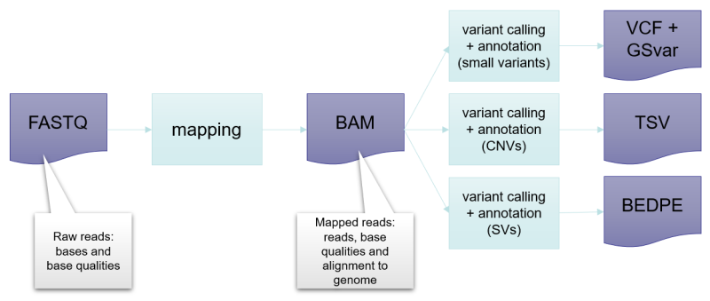
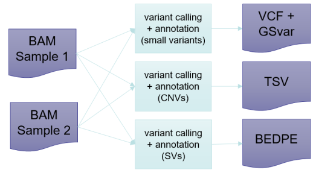
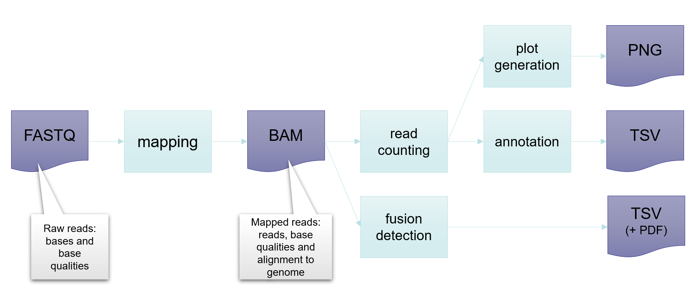
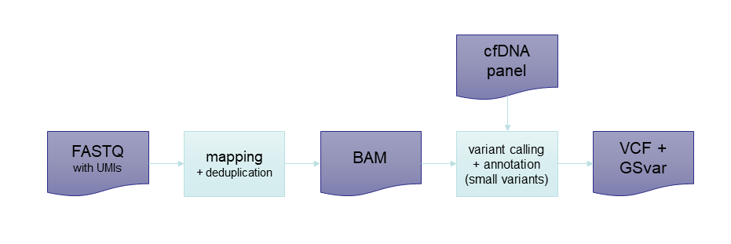
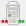
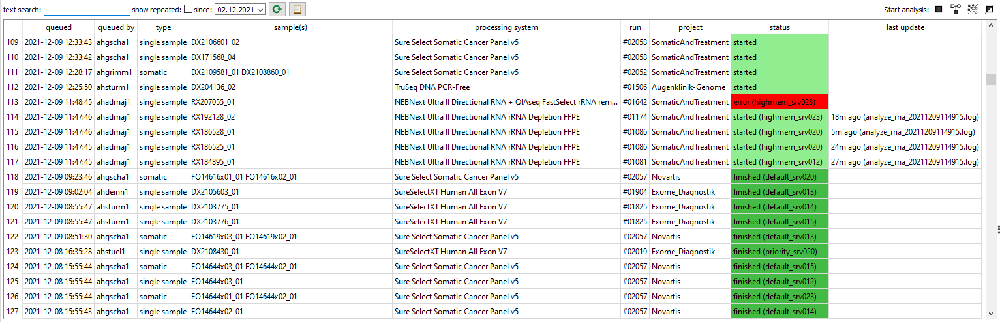
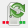
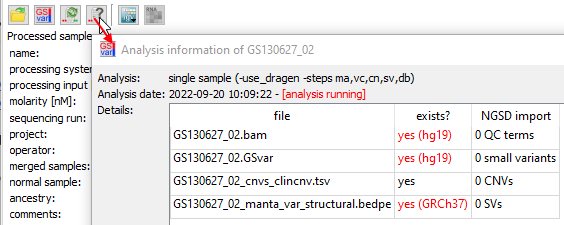

# Data analysis

## What are the analysis steps of the different pipelines?

### germline - single sample pipeline

The germline single-sample pipeline is used to analyze a single case.  
It consists of read mapping and several variant calling and annotation steps:

- **Mapping**: Assignment of reads to the position in the reference genome where they come from (mapping).  
  Part of the mapping is also determine the alignment of the read to the reference genome sequence in case it does not match completely.
- **Variant calling**: Detection of deviations from the reference genome sequence, i.e. detection of variants.  
  Here seperate variant callers are used for small variants, CNVs, structural variants, repeat expansions, etc.
- **Annotation**: Addition of information from tools and databases to the variants to allow interpretetion.  
  The information is typically consequence on cDNA/protein level, frequency in populations, pathogenicity predictions, splicing effect prediction, etc.
  Most of this information comes from databases, e.g. 1000 Genomes, gnomAD, ClinVar, HGMD, OMIM.

The following image shows a simplified single sample pipeline:

The analysis steps of the pipleine are:

|step                          |main task                                  |additional tasks                        |
|------------------------------|-------------------------------------------|----------------------------------------|
|mapping                       |mapping of reads to reference genome       |low-coverage analyis                    |
|SNV/InDel calling + annotation|small variant calling and annotation       |mosaic calling, ROH, BAF, PRS, ancestry |
|CNV calling + annotation      |copy-nnumber variant calling and annotation|mosaic calling                          |
|SV calling + annotation       |structural variant calling and annoation   |repeat expansion calling                |
|database import               |import of QC and variant data into NGSD    |gender check                            |

### germline - multi-sample pipeline / trio pipeline

Multi-sample and trio analyses are bases on mapped reads (BAM file), which is usually generated using the single-sample pipeline.  
On the BAM files the joined variant calling is preformed for all samples.  
Here an example of a multi-sample analysis with two samples:

The analysis steps of the pipleine are:

|step                          |main task                                  |additional tasks                        |
|------------------------------|-------------------------------------------|----------------------------------------|
|SNV/InDel calling + annotation|small variant calling and annotation       |                                        |
|CNV calling + annotation      |copy-number variant calling and annotation |UPD calling (trio only)                 |
|SV calling + annotation       |structural variant calling and annoation   |                                        |
|database import               |import of meta data analysis into NGSD     |                                        |

### somatic tumor-normal pipeline

//TODO Alexander

### RNA pipeline

The RNA pipeline is used to analyze RNA single samples. Since the pipeline doesn't call small variants, no GSvar file will be created. This means a processed sample can't be displayed in GSvar directly. You can either see the results through the linked DNA sample or open the expression files through the processed sample tab.

|step                          |main task                                           |additional tasks |
|------------------------------|----------------------------------------------------|-----------------|
|mapping                       |mapping of reads to reference genome                |                 |
|read counting                 |determine expression of genes and exons             |                 |
|annotation                    |annotation of cohort statistics to expression files |                 |
|fusion detection              |call fusions in RNA data                            |                 |
|database import               |import of QC and expression data into NGSD          |                 |

### cfDNA pipeline

There are two types of cfDNA analysis. The first type is based on a given target region (defined by the processing system) and will report all small variants in this region (processing system type: `cfDNA`).  
The second type is the monitoring of patient-specific tumor variants (processing system type: `cfDNA (patient-specific)`). This pipeline will only report the calls of a set of variants provided by the cfDNA panel of the patient. This panel is ideally created in GSvar through the tumor-normal variant view (`cfDNA` > `Design cfDNA panel`) and stored in the NGSD. If the tumor-cfDNA relation in the NGSD is set correctly the pipeline will automatically use the cfDNA panel in the analysis. Otherwise it has to be provided manually.  
Here the overview of the cfDNA pipeline:

The analysis steps of the pipleine are:

|step                          |main task                                  |additional tasks                        |
|------------------------------|-------------------------------------------|----------------------------------------|
|mapping                       |mapping of reads to reference genome       |deduplication of reads using UMIs       |
|SNV/InDel calling + annotation|small variant calling and annotation       |                                        |
|database import               |import of QC data into NGSD                |check tumor/cfDNA relation              |

## What is the difference between re-annotation and a normal analysis.

When performing re-annotation (i.e. by checking the box `annotate only` in the single-sample analysis dialog) variant calling is skipped.  
Existing variant calls are used and annotations are updated.

This is usually done when the annotation data is older than a few months.  
Up-to-data annotation data is important as public databases (ClinVar, HGMD, OMIM, ...) are updated regularly.

**Note:** Re-anotation is always possible if variants are already called. Re-calling of variants is only possible as long as no report configuration exists for the respecitve variant type. If a report-configuration exists, you need to delete it first: use the delete button in the processed sample tab.

## Where can I trigger analysis jobs?

You can trigger the (re-)analysis of the processed samples from several places in GSvar.

### Analysis status tab

The `analysis status` tab is opened from the GSvar tool bar ():

Here you see all analysis jobs and their current status.

In the upper right corner of the tab, you find buttons to queue the analysis of:

- single sample analysis
- trios analysis
- multi-sample analysis
- somatic analysis

### Processed sample tab

In the upper part of the `processed sample` tab, you can (re-)start the single-sample analysis of the processed sample using the button ().  

### Main tool bar

In the main tool bar, you can restart the analysis of the currently open GSvar file using the button ().  
This works for all analysis types:

- single sample analysis
- trios analysis
- multi-sample analysis
- somatic analysis

### Sample search

The `sample search` can be opened via the main menu bar of GSvar ().  
Here processed samples can be searched for, e.g. of a project, run or processing system.  
Through the context menu of the search results, a batch of samples can be analyzed.

## Where can I see the analysis progress?

The analysis status and progress of individual samples can be shown using the button .  
It is available from tool bar of the `processed sample tab` and through the context menu of `analysis status` table.

Here you can also see:

* if the analysis is currently running
* which of the main steps (mapping, small variant calling, CNV calling, SV calling) is done
* if the QC data and variants are imported into the NGSD database

Steps are marked in red if they are done, but on the old reference genome HG19:

--

[back to main page](index.md)
