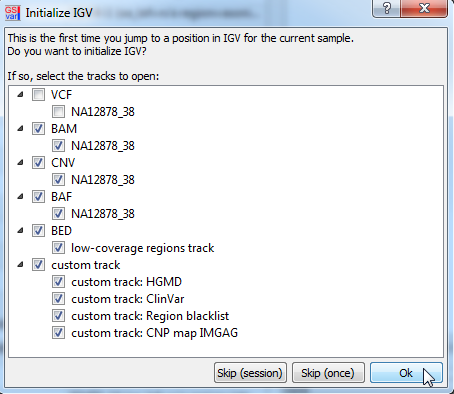
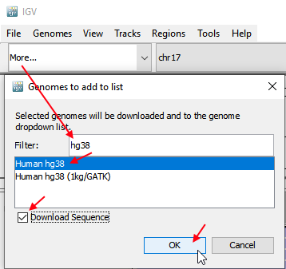
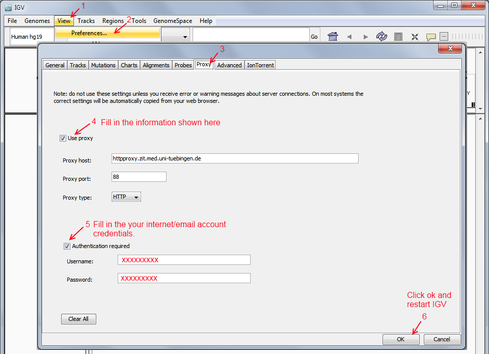

## IGV integration

IGV is a genome brwoser developed at the Broad institute (see also the [IGV user guide](http://software.broadinstitute.org/software/igv/UserGuide)).  
It visualizes high-throughput sequencing data and many associated data formats, e.g.:

* BAM - contains mapped reads
* VCF - contains variants
* BED - contains regions, e.g. target regions, low-coverage regions
* SEG - contains regions,e.g. copy-number calling data

GSvar can communicate with an IGV to open the data and jump to specific genomic positions.  

**Note:** GSvar cannot not start IGV. An instance of IGV has to be started manually before using the IGV integration.

### Jumping to genomic locations

Jumping to a genomic location in IGV can be triggered from several views/dialogs of GSvar:

* *variant list* - clicking the variant coordinate in the variant details view (or double-clicking a line in the variant list) opens the variant location.
* *low-coverage report dialog* - double-clicking a gap line opens the gap location.
* *CNV dialog* - double-clicking a CNV line opens the location.
* *SV dialog* - double-clicking a SV line opens the location. Jumping to start/end breakpoint is possible as well through the context menu.
* *gene selector dialog* - double-clicking a gene list opens the gene locus.

### Initializing an IGV session

When using the IGV integration for the first time, an initialization dialog is shown, in which the user can select with data files should be opened in IGV:

IGV initialization can be perfomed (`Ok`), skipped once (`Skip`), or skipped for the whole session (`Skip (session)`).  
When IGV initialization was perfomed or when was skipped for the session, the initialization dialog will not be shown for any subsequent clicks to a variant/region.

**Note:** Custom tracks can be added by your administrator through the GSvar INI file (see [configuration](configuration.md)).

### Settings for long-read data

IGV settings for long-read data are described [here](igv_settings_lr.md)

## FAQ

### Why are reads colored sometimes?

Colored reads normally mean that the insert size of the read lies outside the expected insert size interval.  
More information can be found at in the [IGV documentation](https://software.broadinstitute.org/software/igv/interpreting_insert_size).

### What is the difference between upper- and lower-case bases in the reference genome sequence?

Lower-case bases are part of a repeat (simple repeat, Alu, etc.).  
To determine repeats [RepeatMasker](http://www.repeatmasker.org/) and similar tools care used.

### IGV is slow sometimes. Can I speed it up?

You can download the genome sequence to speed up IGV:

If the genome download fails, the proxy settings are probably wrong (see the question `IGV cannot load genomes`).

### IGV does not open

Follow these instructions, if only the black console window of IGV but not the actual application opens.

 - Open the path `C:\Users\[login]\` in the Explorer (replace `[login]` by your Windows login).
 - Delete or rename the `igv` folder (if it cannot be deleted, close all IGV windows).
 - Restart IGV.
 - Accept the genomes cannot be loaded dialog with `ok`.
 - Change the proxy settings as described below in `IGV cannot load genomes`.

### IGV cannot load genomes

IGV needs access to the Broad Institute web server to manage non-local genome files.  
If it cannot access the server, during startup `cannot connect to genome server`, `error loading genome` or similar errors are shown.

In case you need to access the internet through a proxy, do this:

### IGV hangs at startup showning a dialog to enter Proxy credentials

Please do the following:

- Close 'Javaw/IGV' via the Windows task manager.
- Start IGV from the Windows start menu.
- Set the proxy data as described in *IGV cannot load genomes*.

### BLAT search of other does not work.

BLAT search tries to access a UCSC webservice over `https`.  
If you are behind a authenticating proxy that uses `basic authentication`, you have to disable `jdk.http.auth.tunneling.disabledSchemes=Basic` in `net.properties` of JDK.

### IGV gene track/genome

To generate a custom genome for IGV with all Ensembl transcripts use the megSAP script [`create_igv_genome.php`](https://github.com/imgag/megSAP/blob/master/src/Auxilary/create_igv_genome.php).  
The created JSON genome file must only be set as `igv_genome` in the `GSvar.ini` and then will always be loaded when you use IGV through GSvar.

### How do I deploy the new IGV version?

Please consult the [our deployment documentation for IGV](install_igv.md).

--

[back to main page](index.md)
