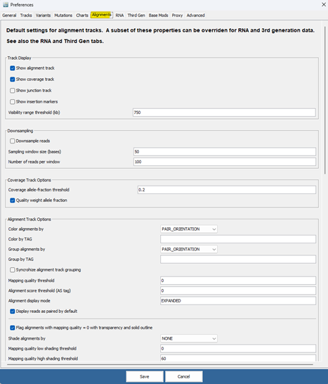
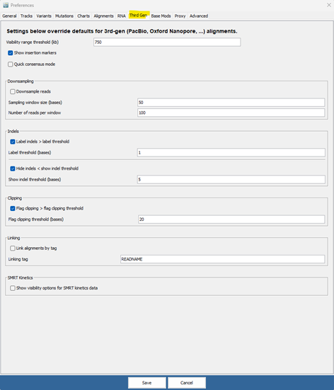
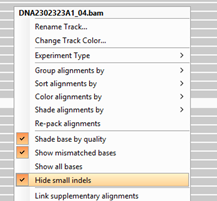
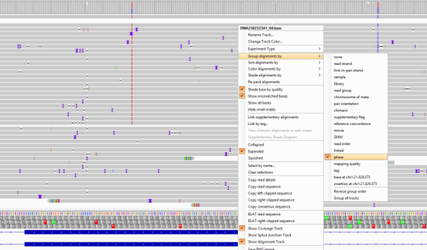
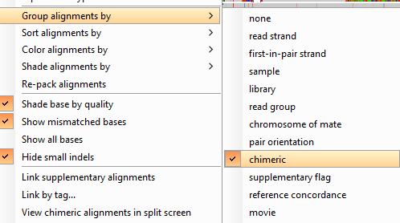
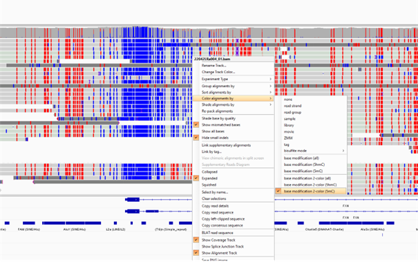

# IGV Settings for LR Analysis

## IGV preferences

1\. general alignment settings for short-read and long-read:

2\. settings specific for long-read sequencing:

 

**Caution:**  
`Hide Indels` is sometimes not automatically enabled or disabled by IGV depending in data type.  
A frameshift variant called in GSvar is not visible in IGV? Remember the `Hide Indels` threshold!

To turn it on/off use the read track context menu:

 
**Quick consensus mode**:  
Variants are sometimes not displayed. Use carefully! 

## Alignment Settings

1\. Group by phase e.g. for haplotype analysis:

2\. Group by Chimeric e.g. for breakpoint analysis

 

For documentation of chimeric reads, see <https://igv.org/doc/desktop/\#UserGuide/tracks/alignments/chimeric\_reads/>

 
### Methylation Analysis

 
To view methylation in IGV, you can select the appropriate setting `base modification 2-color (5mc)` via `Color Alignments by`.  
Hypomethylated bases are marked in blue, while hypermethylated regions are marked in red.

[back to main IGV page](igv_integration.md)
