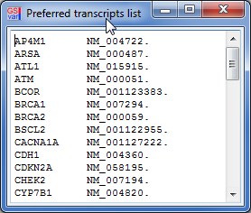

## Preferred transcripts

Some genes have many different transcripts, but in most cases only one of the transcripts is relevant for diagnostics.  
Therefor, one or several preferred transcripts can be defined per gene.

The preferred transcripts are used to:

* automatically select the preferred transcript in the variant details list 
* list only the preferred transcript in the variant details of the report and variant sheet
* highlight the preferred transcript in the `Alamut` contect menu

### Show/edit preferred transcripts

Showing preferred transcripts is done using the menu entry `Tools > Genes > Show/edit preferred transcripts`:

In this dialog you can also edit preferred transcripts.  
The changes are imported when hitting the `ok` button at the bottom of the dialog.

The import does not give any feedback unless an error occurs. 

The preferred transcript list is a tab-separated list with the 

* gene name in first column and
* one or several comma-separated ENST number in the second column.  

--

[back to main page](index.md)
