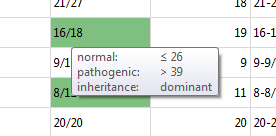
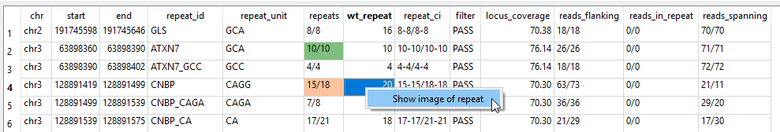

## Repeat expansions

Repeat expansions are called with [ExpansionHunter](https://github.com/Illumina/ExpansionHunter).  
A visualization of the repeats is created using [REViewer](https://github.com/Illumina/REViewer).

### Menu

To open the repeat expansion table click on the RE icon in the main tool bar:  

### Repeat Expansion table

The repeat expansion table contains all repeat expansions which are called by ExpansionHunter:  

The table consists of 11 columns: 

* *chr*, *start*, *end*: chromosomal position of the repeat.
* *repeat_id*: name of the repeat, often gene name (and repeat sequence). Repeats which can not be called reliably on exome samples are marked in red (only in exome samples).
* *repeat_unit*: repetitive sequence of the repeat.
* *repeats*: number of repeats for each allele.  
If additional information is available the entries are colored:
	* : repeat count is in normal range.
	* : repeat count is above normal, but below pathodgenic.
	* : repeat count is pathogenic.  
	
	Additionally each cell contains a tool tip which shows the thresholds, inheritance mode and additional info:  
    
* *wt_repeat*: repeat count of the reference (*wild type*).
* *repeat_ci*: confidence interval of the reported repeat count (for each allele)
* *filter*: result of the QC of ExpansionHunter:
	* PASS: All filters passed.
	* LowDepth: The overall locus depth is below 10x or number of reads spanning one or both breakends is below 5.
* *locus_coverage*: average depth of the repeat region.
* *reads_flanking*, *reads_in_repeat*, *reads_spanning*: number of reads which flank, are contained or span the repeat (for each allele).

### Repeat expansion view

To open a visualization of the repeat expansion, use the context menu:  
  
It opens a SVG image that shows the repeat expansion for each allele.

--

[back to main page](index.md)
