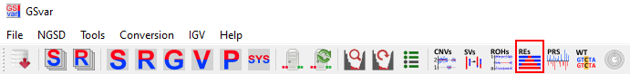
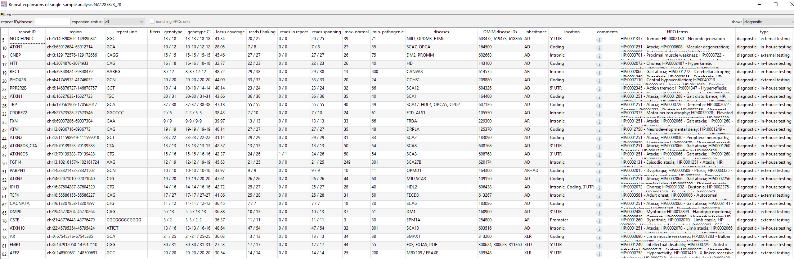

## Repeat expansions

Repeat expansions are called with [ExpansionHunter](https://github.com/Illumina/ExpansionHunter) for short-read data and [Straglr](https://github.com/bcgsc/straglr) for long-read data.  
A visualization of the repeats is created using [REViewer](https://github.com/Illumina/REViewer) for short-read data.

### Menu

To open the repeat expansion table click on the RE icon in the main tool bar:  

### Repeat expansion table

The repeat expansion table contains all repeat expansions which are called by ExpansionHunter:  

The table consists of the folling columns describing the repeat: 

* *repeat ID*: name of the repeat, often gene name (and repeat sequence).
* *region*: chromosomal position of the repeat.
* *repeat unit*: repetitive sequence of the repeat.

Next, are the columns that show the genotype calling data:

* *filters*: filter entries - mostly warnings that the repeat was not reliably called, e.g. beacuse of low depth.
* *genotype*: number of repeats for each allele.
* *genotype CI*: condience intervals for the called number of repeats for each allele.

Additional columns show the number of supporting reads.

Next, are columns with meta data about the repeat the are taken from NGSD:

* *max. normal*: Number of repeats that is normal.
* *min. pathogenic*: Minimum number of repeats for pathogenitity.
* *diseases*: Disease name(s).
* *OMIM disease IDs*: OMIM disease identifiers.
* *inheritance*: Mode of inheritance.
* *lcoation*: location in the gene.
* *comments*: Addititional important information about the repeat, e.g. alternative motifs, interruptions. Shown when hovering over the information icon, or through the context menu.
* *HPO terms*: HPO terms associated with a repeat expansion.
* *type*: 'diagnostic', 'research', or 'low evidence'.

### Context menu

Through the context menu of a repeat expansion, the following functionality is available:

* adding a report configuration and deleting it
* Show distribution of the repeat lengths for the processing system.
* Show a image represetation of the repeat locus with the called repeat lengths and supporting reads.
* Show read length histogram for this sample (only for Straglr).
* Open OMIM gene and disease pages.

### Filtering REs

The dialog offers several options for filteirng REs:

* by RE type (default is to show diagnostic repeats only).
* by expansion status (normal, intermediate, pathogenic). There is also a option to filter for statistical outliers (at least 10% longer than the the 99% percentile of the repeat length distribution).
* by matching HPO term (if HPO terms are set in the main window filters).

### Opening REs in IGV

You can open the RE locus in IGV by double-clicking a repeat expansion line.

### FAQ

--

[back to main page](index.md)
