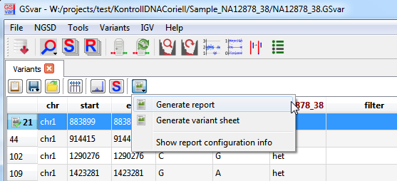

## Report generation

In order to configure a report, report meta data (called *report configuration*) for individual variants can be set.
This report configuration is used to generate reports and *variant sheets*.

### Configuring report variants

The *report configuration* of a sample can be opened by:

* double-clicking the header field of a variant or
* though the context menu of the variant line (or the header field)

The report configuration contains information about the variant type:

* diagnostic variant
* candidate variant
* incidental finding

Additionally, this information is stored:

* if the variant is causal for the phenotype
* inheritance information (inheritance mode, de-novo, ...)
* reason why the variant is not shown in the report (artefact, ...)
* comments of the first/second person that analyzes the sample

### Persistent storage of report configurations

The report configuration of a sample is automatically stored in the NGSD whenever it is modified.
It is loaded automatically loaded the next time the sample is opened.

### Generating a report or variant sheet

Through the report menu, a report for the sample can be generated:

Additionally, a *sample sheet* can be stored as documentation of the variant analysis of the sample.  
It contains all variant that have a *report configuration* including comments.  
