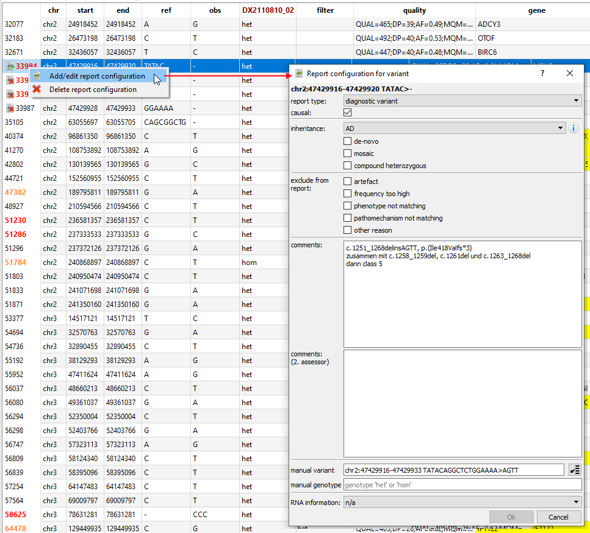

# Report generation

In order to configure a report, report meta data (called *report configuration*) for individual variants can be set.
This report configuration is used to generate reports and *variant sheets*.

## Configuring report variants

The *report configuration* of a sample can be opened by:

* double-clicking the header field of a variant or
* though the context menu of the variant line (or the header field)

The report configuration contains information about the variant type:

* diagnostic variant
* candidate variant
* incidental finding

Additionally, this information is stored:

* if the variant is causal for the phenotype
* inheritance information (inheritance mode, de-novo, ...)
* reason why the variant is not shown in the report (artefact, ...)
* comments of the first/second person that analyzes the sample

## Persistent storage of report configurations

The report configuration of a sample is automatically stored in the NGSD whenever it is modified.
It is loaded automatically loaded the next time the sample is opened.

*Attention: Do not work on the report configuration of the same sample from two or more instances of GSvar. This can lead to data loss!!*

## Manual curation of variants

In the report configuration you can manually changes some aspects of the variants.  

This is usually necessary for example in these cases:

- a complex small variant are split into several variants during variant normalization.
- a large CNV is split into several CNVs because it contains regions that are copy-number polymorphic.
- the genotype of a small variant, a CNVs or a SVs is not correctly detected.

Generally, if a single variant is split into several variants, exclude all but one of the fragments from the report using `other reason` and document that the variant belongs to a splot variant in the comments.

### Manual curation of small variants

For small variants the following properties can be changed:

- the variant itself (the coordinates have to be near the original variant though)
- the genotype

This is the respective part of the report configuration dialog:

The button on the right is used to import a variant in several formats (GSvar, VCF, HGVS.c).

### Manual curation of CNVs

For copy-number variants the following properties can be changed:

- the start position
- the end position
- the copy-number
- the HGVS type
- the HGVS suffix (after type)

This is the respective part of the report configuration dialog:

### Manual curation of SVs

For structural variants the following properties can be changed:

- the start position
- the end position
- the genotype
- the start position of the second breakpoint (BND only)
- the end position of the second breakpoint (BND only)
- the HGVS type
- the HGVS suffix (after type)

This is the respective part of the report configuration dialog:

## Generating a report or evaluation sheet

Through the report menu, a report for the sample can be generated:

Additionally, a *evaluation sheet* can be stored as documentation of the variant analysis of the sample. 
It opens a dialog which has to be filled with details of the analysis and creates a HTML document which contains all variant that have a *report configuration* including comments.

