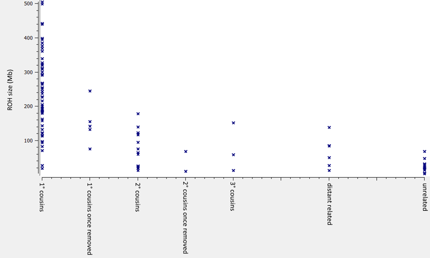
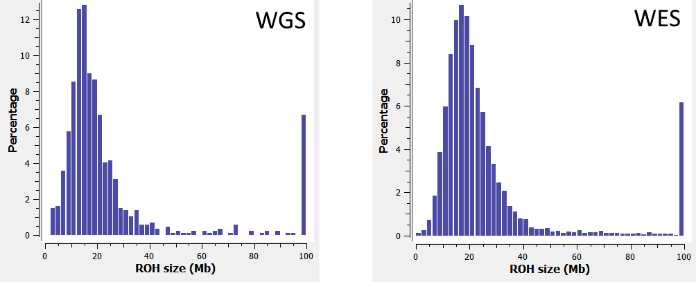
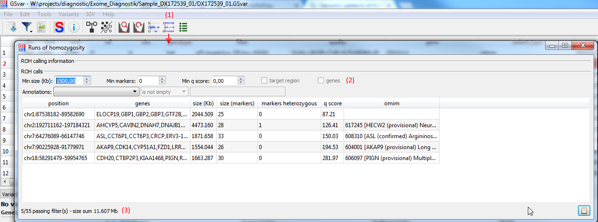
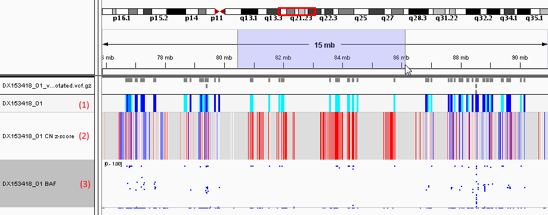

## ROH analysis

### Introduction

Runs of Homozygosity (ROH) are stretches of considerable size in the genome of an individual that contain only homozygous variants. 

[Pemberton et. al.](https://www.ncbi.nlm.nih.gov/pubmed/22883143) identified three classes of ROHs:

* A (short, &lt;500Kb): Ancient haplotypes
* B (intermediate, 500-1500Kb): Background relatedness due to limited population size
* C (long, &gt;1500Kb) Recent parental relatedness

Large ROHs are typically caused by:

1. Recessive inherited from a common ancestor due to inbreeding.
2. Uniparental disomy.
3. Heterozygous deletions.

The following plot gives an impression of the amount of ROHs that one can expect when dealing with consanguinous patients.  
The cummulative ROH size is plotted against the degree of relatedness:

The following histograms show the size sum distribution of **class B/C ROHs (i.e. &ge; 500Kb)** for WGS (Illumina TruSeq DNA PCR-Free) and WES (Agilent SureSelect Human All Exon v7):

In both WES and WGS, a good hint of consanguinity is the **sum of ROHs larger than 500Kb (class B/C) &ge; 70Mb**.  
If it is bigger than 70Mb consanguinity can be assumed, unless there are other sources of ROHs like large deletions.

### ROH viewing and filtering

ROHs of a sample are shown in a separate dialog that can be opened from the main tool bar (1)

Above the ROH list, there are several options for filtering (2):

* size (Kb)
* size (markers)
* q-score
* target region (if set in the main filter panel for variants)
* genes (if set in the main filter panel for variants)
* generic annotation filters

### Visualizing ROH data in IGV

*Double-clicking* a ROH in the dialog, opens the ROH region in IGV (see also section [IGV integration](igv_integration.md)).

There is no direct visualization of ROHs in IGV. However, there are two ways to visualize ROHs indirectly:

* If the sample folder contains a b-allele frequency (BAF) file in SEG format, it can be shown in IGV.
* The variant track can display variant genotypes which can be used to visualize ROHs as well.

The screenshot below shows a 6Mb heterozygous deletion, indicated by the selection.  

* The top track (1) shows the variant genotypes. Up- and downstream of the deletion heterozygous variants are shown (dark blue), inside the deletion there are only homozygous variants (cyan).
* The middle track (2) shown copy-number information. The red lines indiocate exon deletions.
* The bottom tack (3) shown  b-allele frequencies. It is easy to see that there are no heterozygous variants in the deletion region.

### UPD calling (trio only)

If the analysis is a trio-analysis, UPDs are called in addition to ROHs using the [UpdHunter tool](https://github.com/imgag/ngs-bits/blob/master/doc/tools/UpdHunter.md).  

In case UPDs are called, a dialog with the UPD type and locus is shown when opening the RE dialog.

--

[back to main page](index.md)
