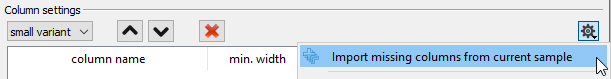

# GSvar settings

## General

If you are behind a proxy server, enter your proxy information here.

## IGV

Here you can customize which files are opened in IGV by default.

## View

Here you can set how you want numbers with many digits to be shown.

## Columns

Here you can customize the column order/width/visibility for small variants, CNVs and SVs.

To customize columns, you first have to import the column names.  
Open a sample and add the missing column names like that:  

Then you can set the column with and visibilty in the table.  
You can change the column order using the array buttons above the column table.

*Note:  
Column order settings changes take effect for small variants when re-loading the sample.  
For CNVs and SVs they take effect when re-opening the respective dialog.*

--

[back to main page](index.md)
