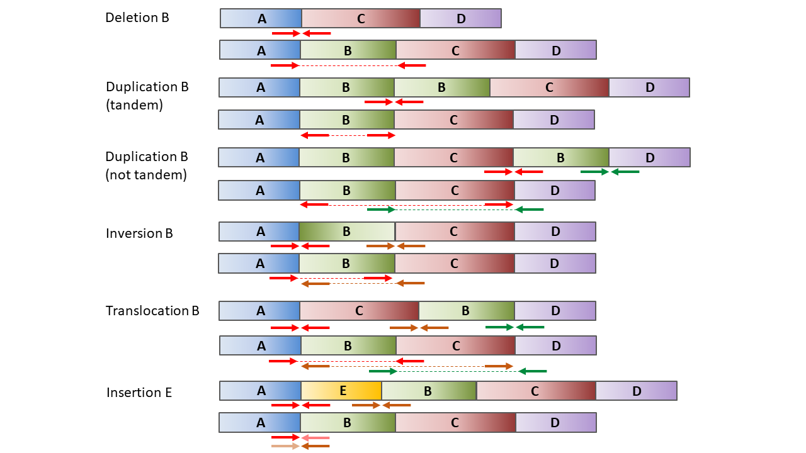
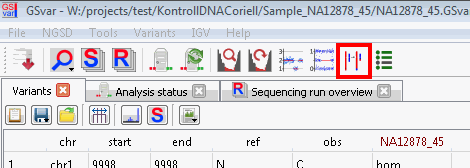
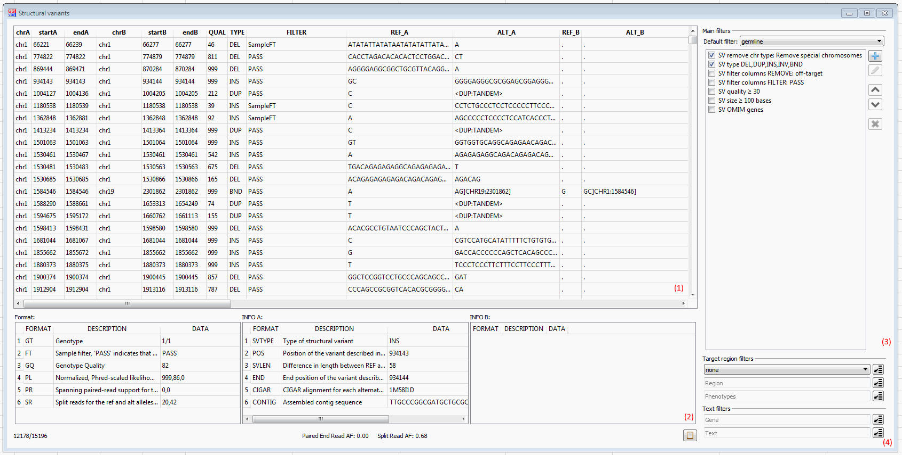
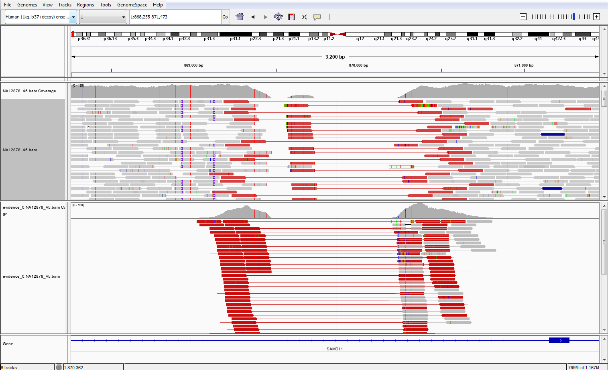
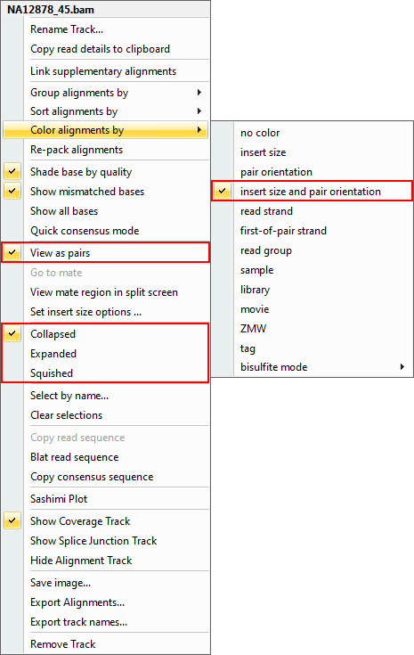
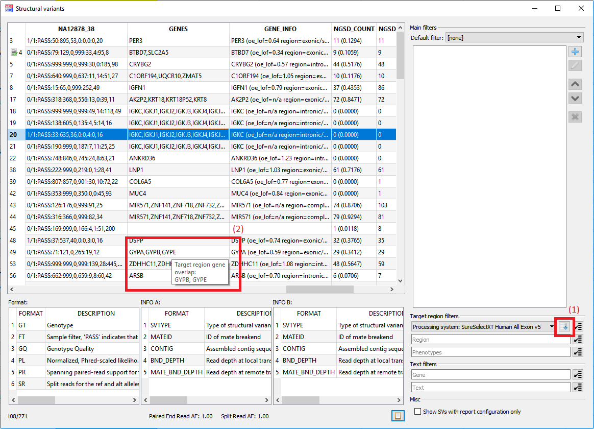

## SV analysis

Structural variant (SV) calling is performed based on paired-end reads which are mapped on different areas or in different orientations and based on soft-clipped bases.
There are five different structural variants which are detected by a characteristic paired-end read pattern. This plot gives the genome structure of a sample (top) and the read representation in IGV (bottom) for several common structural variants:

Deletions can be detected by paired-end reads which overlap the deletion. After mapping one mate of these reads is mapped to the start of the deletion and the other mate to the end of the deletion. 

Tandem duplications can be detected by reads which overlap the end of the original segment and the start of the duplication. In the genome mapping one mate of these reads is mapped to the start of the duplicated segment and the other to the end of the duplicated segment, but both in opposite orientation. Non-tandem duplications are detected similarly: Here reads which overlaps the start and end of the inserted duplication are necessary. In the genome mapping one mate of these reads is mapped right before the start of the inserted duplicate and the other mate to the start of original duplicated segment (in case the read overlaps the start) or one mate is mapped to the end of the duplicated and the other mate is mapped right behind the end of the inserted duplicate (in case the read overlaps the end).

Inversions are detected by reads which overlap either the start or the end of a inverted segment. In the genome mapping one mate of these reads is mapped right before the start of the inversion and the other mate is mapped to the end of the inverted segment in opposite orientation (in case the read overlaps the start) or one mate is mapped to right behind the inversion and the other mate is mapped to the start of the inverted segment in opposite orientation (in case the read overlaps the end).

To detect translocations again reads are required which overlap the start and end position of the translocation and reads which overlap the original position of the translocated segment. During mapping one mate of reads which overlap the start and end position of the translocated segment is mapped right before/after the translocation and the other mate is mapped to the start/end of the translocated segment. Additionally one mate of reads which overlap the original position is mapped right before the translocated segment and the other mate right behind it (similar to a deletion of this segment).

For the detection of insertions reads which overlap the start and end of the insertion. After mapping one mate of these reads is mapped right before/after the insertion whereas the other mate cannot be mapped to the reference.

## Algorithm details

For SV calling [Manta](https://github.com/Illumina/manta) is used.  
For algorithm details, see the Manta documentation.

## SV analysis window

The visualization and filtering of is done with the "Structural variants" dialog which can be started from the main menu:

The "Structural variants" dialog shows the filtered list of all detected SVs with all annotations in the top left table view (1). For each SV the following values are shown:

* genomic position
* quality
* SV type
* filter
* sequence of the reference
* sequence of the SV
* genes
* gene info: gene-specific information from NGSD
	* gnomAD o/e score for LOF variants
	* overlap with gene (complete, intronic/intergenic, exonic/splicing) 
* NGSD count: number of exact matches in the NGSD and the allele frequency in brackets
* NGSD overlap: number of SVs of the sample type in the NGSD which overlap the current SV
* OMIM genes	

Additionally the `Format` and `Info` columns of the currently selected SV is expanded below this table (2). On the right side there is a filter widget similar to the variant or CNV view where filters can be added and modified (3). Below that the target, chromosomal or phenotype region can be defined and the SVs filtered by genes or text (4). 

More documentation about the Manta output can be found in the [Manta documentation](https://github.com/Illumina/manta/blob/master/docs/userGuide/README.md).

## Filtering SVs

A set of default filters can be loaded by selecting a set of filters in the drop-down menu above the filter widget (3). Since the useful filter settings highly depends on the sample, most of the filters are deactivated by default and can be activated by checking the corresponding checkbox. There are four default filter sets for germline which can be selected depending on the sample:

* *wgs stringent*
* *wgs relaxed*
* *exome stringent*
* *exome relaxed*

The relaxed filter sets contain the following default filters:

* *SV remove chr type* (enabled by default): This filter removes all structural variants which are located on non-standard chromosomes.
* *SV allele frequency NGSD ≤ 1%* (enabled by default, only WGS): This filter removes all structural variants which have a allele frequency of more than 1% in the NGSD.
* *SV count NGSD ≤ 30* (enabled by default, only exome): This filter removes all SVs with at least 30 hits in the NGSD.
* *SV type* (disabled by default): This filter can be modified to limit the analysis to a certain set of SV types (e.g. only analyze deletions).
* *SV genotype* (disabled by default): This filter can be used to display only hom/het structural variants.
* *SV OMIM genes* (disabled by default): Removes all SVs which do not overlap with an OMIM gene.
* *SV gene overlap: complete, exonic/splicing* (disabled by default): Removes all SVs which do not overlap with a complete gene or with an exon/splice region.
* *SV compound-heterozygous* (disabled by default): Filter for compound-heterozygous SVs.

The stringent filter sets contain additional quality filters:

* *SV filter columns FILTER: PASS* (enabled by default): Displays only SVs which pass the Manta quality control.
* *SV PE read depth ≥ 5* (enabled by default): Shows only SVs which are supported by at least 5 paired-end reads.
* *SV quality ≥ 100* (enabled by default): Displays only SVs which have a quality score of at least 100.

Important note to the *SV count NGSD*/*SV allele frequency NGSD* filters: 

On exome samples the reads are not distributed uniformly over the target region, so a correct calculation of the allele frequency of a SV cannot be done. This means that the *SV allele frequency NGSD* filter should only be used on whole genome samples. For all other samples the *SV count NGSD* filter can be used.

Other useful filters:

* *SV count NGSD*: This filter has a additional option to also consider overlapping SVs of the same type from the NGSD (`NGSD overlap` column). Since frequent SVs are sometimes not called at the exact same position, this filter can be useful to reduce the number of remaining SVs.

A list of all available filters can be found here: [SvFilterAnnotation](https://github.com/imgag/ngs-bits/blob/master/doc/tools/SvFilterAnnotations.md)

## Opening SVs in IGV

A double click on a structural variant will open this variant in IGV. In case of a translocation a double click will open only the first breakpoint. To display the second breakpoint right click and select *Open position B in IGV* or *Open position A/B in IGV split screen*. In the following dialog select the Manta evidence BAM file:

In IGV you have now two tracks of reads. One contains all the reads of the selected area and the other contains only reads wihich were used by Manta as evidence to call the selected structural variance:

## IGV settings

The following view settings are recommended and can be selected by right clicking on a BAM track and selecting the corresponding menu entries:

* *View as pairs* connects each read with its mats by a line and shows them together.
* *Color Alignments by* -> *insert size and pair orientation* colors with high insert size or wrong read orientation.
* *Collapsed*/*Squished* reduces the height for each read which allows to display more reads. This can be useful depending on sample depth and display resolution.
* *Group alignments by* -> *chromosomes of mate* can be useful to visualize translocations.

## FAQ

### (Re-)start SV analysis

Please check the [data analysis](data_analysis.md) section.

### How do I get the genes of a SV which overlaps the selected target region

Requirements: To calculate the overlap between the SVs and the selected target region you need to have access to the NGSD and a gene file containing all genes of the target region (named `..._genes.txt`) at the same location as the target region file. 

After a target region is selected and a gene file is available you can click on the button right next to the drop-down menu of the target region (1). Since the computation can take some time (depending on the size of the target region) this has to be done manually every time the target region is changed. As soon as the computation is finished you can hover over the "`GENES`" column to see the genes of the target region in a tool tip (2).

--

[back to main page](index.md)
