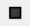
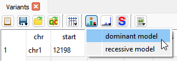
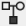
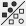

# Small variant analysis

The data format for small variants (SNVs and InDels) is the `GSvar format`.  
It contains the variants, annotations of the variants and meta data.  
Detailled documentation of the format can be found [here](gsvar_format.md).  

The GSvar application provides default filters, for the most common filter operations.  
These filters can be further modified according to user needs.  
Additionally, powerful custom filters can be created by combining several filter steps.  
A documentation of available filter steps and their parameters can be found [here](https://github.com/imgag/ngs-bits/blob/master/doc/tools/VariantFilterAnnotations.md).

## Single-sample analysis

To perform a single sample analysis, follow those steps:

1. If the samples is not already analyzed, open the analysis status dialog from the main tool bar  and trigger the analysis using the single sample button .
2. When the analysis is finished, open the variant list of the sample using `File > Open by name`.
3. Select one of the default filters `recessive` and `dominant`
4. Set the patient's phenotype as filter (or load it from NGSD using the context menu of the phenotype filter).

### Automated ranking of small variants

GSvar has a built-in ranking algorithm for small variants, which scores and ranks variants in the context of the patient's phenotype.

The input of the algorithm is the variant list of a sample and the phenotype information of the patient.  
After loading a sample into GSvar and setting the phenotype filter, you can start the algorithm from the tool bar:  

The algorithm runs for a few seconds. It adds the three columns to the variant list:

- GSvar_score: The score of the variant.
- GSvar_rank: The rank of the variant based on the scores.
- GSvar_score_explainations: A list of contributing criteria their part of the score.

By default the top 10 variants are shown by the filter `GSvar score/rank`, which is automatically set after the ranking.  
You can however change the number of variants that are shown in the filter widget.

**Notes:**  

- A detailled description of the ranking algorithm can be found in the documentation of the corresponding command-line tool [VariantRanking](https://github.com/imgag/ngs-bits/blob/master/doc/tools/VariantRanking/index.md).
- More benchmarks can be found in the [aiDIVA paper](https://www.medrxiv.org/content/10.1101/2025.09.04.25335099v1), in which the algorithm is used to calculate the `evidence-based scores`.

### Mosaic variants

Mosaic variants down to 3% allele frequency are called by default.  
They are contained in the main variant list, but are flagged with the filter entry `mosaic`.  
They are called on the following target region, depending on the processing system:
  
  - WGS: exons regions plus/minus 20 bases.
  - WES: target region of the processing system.
  - panel: target region of the processing system.

Mosaic variants are filtered out by most default filters.  
Use the filters 'mosaic WGS' or 'mosaic WES' to look at them specifically.

### Variants in not uniquely mappable regions

Variant in not uniquely mappable regions, i.e. reads have a mapping quality of 0, are called by default.  
They are contained in the main variant list, but are flagged with the filter entry `low_mappabilty`.  
They are called on the following target region, depending on the processing system:
  
  - WGS: pre-calculated mapping quality 0 region.
  - WES: intersection of target region of the processing system and pre-calculated mapping quality 0 region.
  - panel: intersection of target region of the processing system and pre-calculated mapping quality 0 region.

Low mappability variants are filtered out by most default filters.  
Use the filter 'low mappability' to look at them specifically.

## Gaps in diagnostic target region

A important part of diagnostics is to determine the gaps of the analysis.  
Gaps are bases that are not covered by enough reads or by low mapping quality reads, i.e. they are not uniquely mapped.

Gaps in the target region of the processing system of a sample are pre-calculated during the megSAP analysis using a cutoff of 20x.  
The calculated gaps are annotated with gene names for easy lookup.

### Lookup of gaps

You can look up the pre-calculated gaps for a gene set or a target region using this button from the main toolbar:  

The dialog shows the gaps in the given target region, annotates them with gene names and highlights coding/splicing regions.

**Note:**

- By default only coding/splicing region gaps are shown.
- When the processing system is not WGS, regions that are not part of the target region are shown as gaps independent of the depth.

## Trio analysis

To perform a trio analysis, follow those steps:

1. Open the analysis status dialog from the main tool bar  and trigger the trio analysis using the trio button .  
2. When the analysis is finished, a folder with the prefix 'Trio_' and the sample names was created.  
Open the GSvar variant list from the trio folder.
3. For filtering the trio variant list, use one of the default `trio` filters.
4. Default filter can be modified and new filters created using the filter toolbar on the right.

**Note:**  
Before performing a trio analysis, always have a look at the index case as a single sample.  
It is possible to miss the causal variant if performing multi-sample analysis only.  
This has both technical and biological reasons (low coverage in one sample, reduced penetrance, mosaic variants,...).

## Multi-sample analysis

To perform a multi-sample analysis, follow those steps:

1. Open the analysis status dialog from the main tool bar  and trigger the multi-sample analysis using the trio button .  
2. When the analysis is finished, a folder with the prefix 'Multi_' and the sample names was created in the project folder.  
Open the GSvar variant list from the trio folder.
3. For filtering the trio variant list, use the default `multi-sample` filters.
4. Default filter can be modified and new filters created using the filter toolbar on the right.

**Note:**  
Before performing a multi-sample analysis, always have a look at the index cases as single samples.  
It is possible to miss the causal variant if performing multi-sample analysis only.  
This has both technical and biological reasons (low coverage in one sample, reduced penetrance, mosaic variants, ...).

--

[back to main page](index.md)
