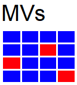

## Variant filtering

The data format for small variants (SNVs and InDels) is the `GSvar format`.  
It contains the variants, annotations of the variants and meta data.  
Detailled documentation of the format can be found [here](gsvar_format.md).  

The GSvar application provides default filters, for the most common filter operations.  
These filters can be further modified according to user needs.  
Additionally, powerful custom filters can be created by combining several filter steps.  
A documentation of available filter steps and their parameters can be found [here](https://github.com/imgag/ngs-bits/blob/master/doc/tools/VariantFilterAnnotations.md).

### Single-sample analysis

To perform a single sample analysis, follow those steps:

1. Open the analysis status dialog from the main tool bar  and trigger the analysis using the single sample button .
2. When the analysis is finished, open the GSvar variant list.
3. For filtering the variant list, use one of the default `recessive` and `dominant` filters.
4. Default filter can be modified and new filters created using the filter toolbar on the right.
5. The single sample pipeline also calls potential mosaic variants. These can be opened in a seperate window with the mosaic variant button 
6. For mosaic variants there are two default filters available: Mosaic WGS and Mosaic WES

### Trio analysis

To perform a trio analysis, follow those steps:

1. Open the analysis status dialog from the main tool bar  and trigger the trio analysis using the trio button .  
2. When the analysis is finished, a folder with the prefix 'Trio_' and the sample names was created.  
Open the GSvar variant list from the trio folder.
3. For filtering the trio variant list, use one of the default `trio` filters.
4. Default filter can be modified and new filters created using the filter toolbar on the right.

**Note:**  
Before performing a trio analysis, always have a look at the index case as a single sample.  
It is possible to miss the causal variant if performing multi-sample analysis only.  
This has both technical and biological reasons (low coverage in one sample, reduced penetrance, mosaic variants,...).

### Multi-sample analysis

To perform a multi-sample analysis, follow those steps:

1. Open the analysis status dialog from the main tool bar  and trigger the multi-sample analysis using the trio button .  
2. When the analysis is finished, a folder with the prefix 'Multi_' and the sample names was created in the project folder.  
Open the GSvar variant list from the trio folder.
3. For filtering the trio variant list, use the default `multi-sample` filters.
4. Default filter can be modified and new filters created using the filter toolbar on the right.

**Note:**  
Before performing a multi-sample analysis, always have a look at the index cases as single samples.  
It is possible to miss the causal variant if performing multi-sample analysis only.  
This has both technical and biological reasons (low coverage in one sample, reduced penetrance, mosaic variants, ...).

--

[back to main page](index.md)
