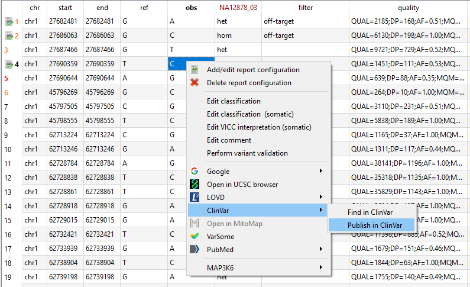

## Variant publication

Pathogenic variant should be uploaded to one of the public variant databases.  
With this release [ClinVar](https://www.ncbi.nlm.nih.gov/clinvar/) upload is supported and the LOVD upload was removed.

### Submitting SNVs/InDels

Database upload for SNVs and InDels is triggered from the context menu of variants in the main window of a **single sample** variant list.
To upload a variant the following requirements have to be fulfilled:

- (1) The variant has to have a report configuration (and also be in the NGSD)
- (2) The variant has to have a valid classification
- (3) The sample has to have at least one valid OMIM/Orpha disease identifier

The following example shows how a variant can be selected and uploaded to ClinVar:

The submission dialog then allows easy upload using these steps:

- (1) Modify the list of affected genes (can be empty).
- (2) Fill in missing variant details (e.g. affected status, allele origin). 
- (3) Select phenotypes (these are automatically imported from GenLab if possible).
- (4) Add additional comment for phenotype (optional).
- (5) Fill in missing details of the clinical significance (e.g. inheritance).
- (6) Upload to ClinVar (only possible if all required fields are filled).
- (7) Print upload results.

### Submitting CNVs, SVs, etc.

For variants other than SNVs/InDels, use the Submission Portal of ClinVar:

[ClinVar Submission Portal](https://submit.ncbi.nlm.nih.gov/clinvar/)

In order to submit variant to Clinvar you need a NCBI account which is linked to your organization/institute. Since NCBI disabled the creation of new accounts an ORCiD account is needed beforehand. If you already have an ORCiD account you can skip the next chapter.

#### Create Orcid account

To create an ORCID account go to [https://orcid.org/](https://orcid.org/) and click on `SIGN IN/REGISTER`.

Then select `Register now` and follow the instructions.

#### Create NCBI account

The ORCID account can be used to login into ClinVar/NCBI and allows you to create a new NCBI account.

First go to the [ClinVar Submission Portal](https://submit.ncbi.nlm.nih.gov/clinvar/), click on `Log in` in the top right corner and choose `ORCiD`.

On the next site log in with your ORCiD credentials and allow to link ClinVar with ORCiD.

Now you can create a NCBI account:

Finally you have to complete your NCBI profile and your account has to be added to the group of your organization/institute. This can be done by one of the administrators of the group.

#### Upload variant to ClinVar

Log in into ClinVar and visit the [ClinVar Submission Portal](https://submit.ncbi.nlm.nih.gov/clinvar/). Here select `ClinVar single submission wizard` and go through the steps on the following pages.

Detailed help about the single steps can be found on the ClinVar website:
 - [Detailed help for the ClinVar Submission Wizard](https://www.ncbi.nlm.nih.gov/clinvar/docs/wizard/)
 - [YouTube video](https://www.youtube.com/watch?v=IP0wr7JSvU4)

## FAQ

### There is no context menu entry for database upload.

To activate the database upload, the API key for ClinVar need to be set in the `GSvar.ini` file by the administrator.

### Phenotypes are not automatically imported from GenLab.

Make sure the the field 'Labornummer' is filled in for your assay in GenLab. Otherwise the sample cannot be matched to the NGS data.

--

[back to main page](index.md)
