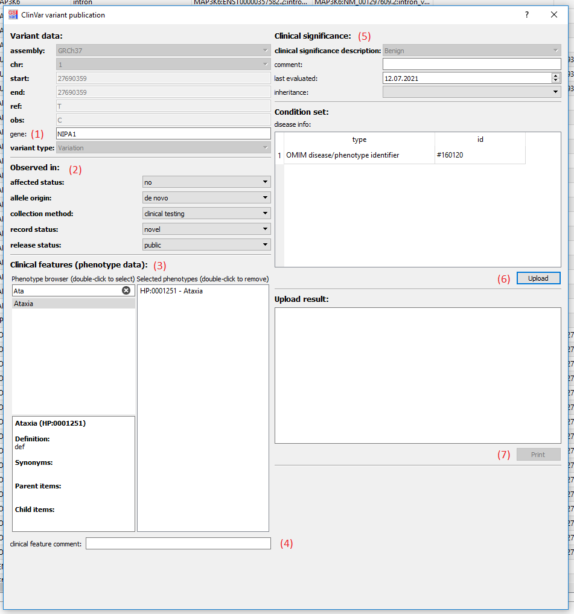

## Variant publication

Pathogenic variant should be uploaded to one of the public variant databases.  
With this release [ClinVar](https://www.ncbi.nlm.nih.gov/clinvar/) upload is supported and the LOVD upload was removed.

### Submitting SNVs/InDels

Database upload for SNVs and InDels is triggered from the context menu of variants in the main window of a **single sample** variant list.
To upload a variant the following requirements have to be fulfilled:

- (1) The variant has to have a report configuration (and also be in the NGSD)
- (2) The variant has to have a valid classification
- (3) The sample has to have at least one valid OMIM/Orpha disease identifier

The following example shows how a variant can be selected and uploaded to ClinVar:

The submission dialog then allows easy upload using these steps:

- (1) Modify the list of affected genes (can be empty).
- (2) Fill in missing variant details (e.g. affected status, allele origin). 
- (3) Select phenotypes (these are automatically imported from GenLab if possible).
- (4) Add additional comment for phenotype (optional).
- (5) Fill in missing details of the clinical significance (e.g. inheritance).
- (6) Upload to ClinVar (only possible if all required fields are filled).
- (7) Print upload results.

### Submitting CNVs, SVs, etc.

For variants other than SNVs/InDels, use the Submission Portal of ClinVar:

[ClinVar Submission Portal](https://submit.ncbi.nlm.nih.gov/clinvar/)

## FAQ

### There is no context menu entry for database upload.

To activate the database upload, the API key for ClinVar need to be set in the `GSvar.ini` file by the administrator.

### Phenotypes are not automatically imported from GenLab.

Make sure the the field 'Labornummer' is filled in for your assay in GenLab. Otherwise the sample cannot be matched to the NGS data.

--

[back to main page](index.md)
