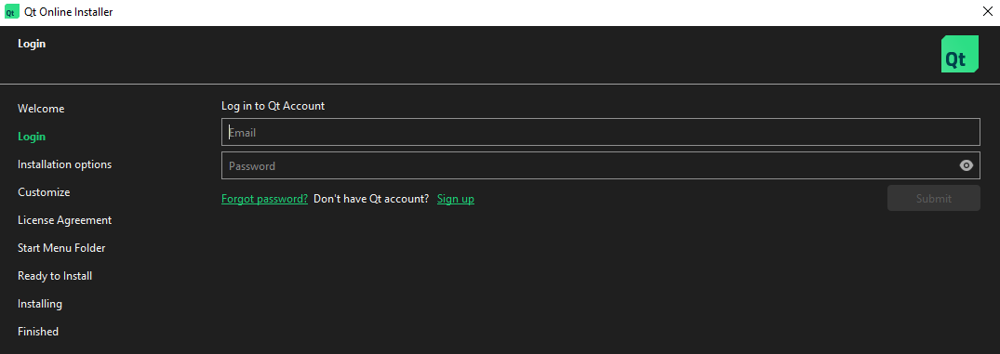
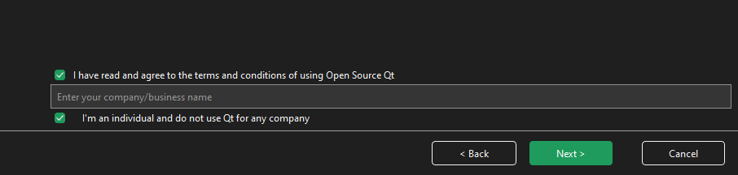
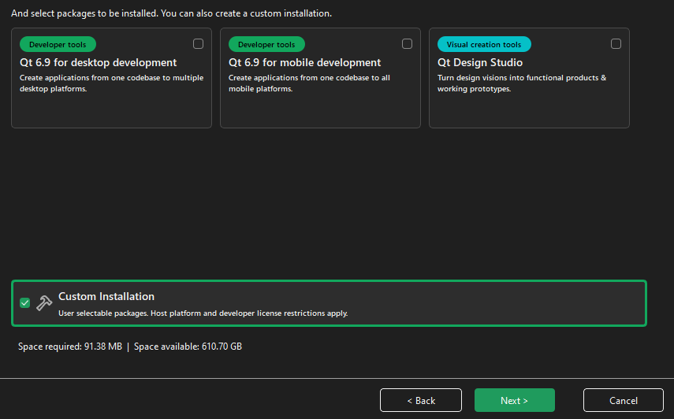
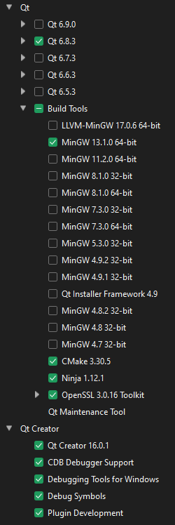
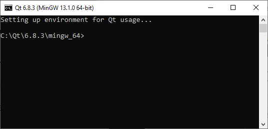

# Building ngs-bits from sources (Windows)

This manual assumes you have already retrieved a local copy of the [github respository](https://github.com/imgag/ngs-bits), as it has been described at [the main page](../README.md)

## Dependencies

### Install Qt

First, we need to install Qt and some basic dependencies:

* Download and launch [Qt online installer](https://www.qt.io/download-qt-installer-oss). The online installer requires to have a Qt Account: you can create it free of charge [here](https://login.qt.io/login).
* During the installation you will need to login with your Qt credentials:

* The installer will also ask if you belong to an organization (as an individual developer, you may leave this field empty): 
* Select the `Custom installation`:

* Choose Qt 6.8.3 (select all components, since we will need them, especially the source code), build tools (MinGW 13.1.0 , CMake, Ninja, OpenSSL), Qt Creator (all components):

  
* The installation may take a while, its total duration mainly depends on your internet connection speed, since the installer downloads everything from the server (about 7GB).

### Unpack htslib

[htslib](https://github.com/samtools/htslib) is a third-party library that provides functionality for NGS data formats like BAM or VCF.

We have pre-built `htslib` for Windows. The corresponding ZIP archive can be found in `ngs-bits\htslib\`.  
Just unzip the contents of the ZIP archive into the `ngs-bits\htslib\` folder.

### Unpack libxml2

[libxml2](https://github.com/GNOME/libxml2) is a library that allows to validate XML against a schema file. Unzip `ngs-bits\libxml2\libxml2_win_64.zip`. Qt Creator will detect the library files and headers while compiling ngs-bits and GSvar.

### Build SQL plugin for Qt

The Qt distribution no longer contains a MySQL plugin, so we need to build it manually:

* Download [MariaDB Connector C 64-bit](https://downloads.mariadb.com/Connectors/c/connector-c-3.4.7/mariadb-connector-c-3.4.7-win64.msi).
* Run the installer and choose the `Complete` setup type.

Qt community provides some [instructions](https://doc.qt.io/qt-6/sql-driver.html) on how to build the plugin. You may consult their page, if you encounter any issues.  
We have summarized the tutorial, here:

In the main Windows menu search, type `mingw` and open `Qt 6.8.3 (MinGW 13.1.0 64-bit)` terminal window.

Assuiming you have installed Qt 6.8.3 into C:\Qt folder, run the following commands to build the database plugin (run them in `MinGW` terminal, not in the standard Windows CMD or PowerShell terminals):
	
	> cd C:\Qt\6.8.3\Src\qtbase\src\plugins\sqldrivers
	> set PATH=C:\Qt\Tools\CMake_64\bin;%PATH%
	> set PATH=C:\Qt\Tools\Ninja;%PATH%
	> mkdir build-sqldrivers
	> cd build-sqldrivers
	> qt-cmake -G Ninja C:\Qt\6.8.3\Src\qtbase\src\plugins\sqldrivers -DMySQL_INCLUDE_DIR="C:\PROGRA~1\MariaDB\MARIAD~1\include" -DMySQL_LIBRARY="C:\PROGRA~1\MariaDB\MARIAD~1\lib\libmariadb.lib" -DCMAKE_INSTALL_PREFIX="C:\Qt\mariadb_plugin"
	> cmake --build .
	> cmake --install .
	> copy C:\Qt\mariadb_plugin\plugins\sqldrivers\qsqlmysql.* C:\Qt\6.8.3\mingw_64\plugins\sqldrivers\
	> copy C:\PROGRA~1\MariaDB\MARIAD~1\lib\libmariadb.* C:\Qt\6.8.3\mingw_64\plugins\sqldrivers\

Upon succesfull completion, `qsqlmysql.dll` and `libmariadb.dll` sould be located in `C:\Qt\6.8.3\mingw_64\plugins\sqldrivers\`.

### Install Git

Download and install [Git](https://git-scm.com/download/win).  
It is needed to extract the repository version during the build process.

### Install python

To create plots in qcML files, install the portable version of [WinPython](https://github.com/winpython/winpython/releases/download/16.6.20250620final/Winpython64-3.13.5.0whl.7z) and add the directory containing the `python.exe` to the PATH.

You have to install `maplotlib` in case it is not found:

	> python.exe -m pip install matplotlib

This is optional. If python is not installed, no plots are generated.

## Build ngs-bits and GSvar

we can now build ngs-bits:

* Build the ngs-bits tools using the QtCreator project file `src\tools.pro`. Make sure to build in release mode!  
* Then, build GSvar and other GUI tools using the *QtCreator* project file `src\tools_gui.pro`. Make sure to build in release mode!  

*Attention: Make sure to compile the [CRYPT_KEY](GSvar/encrypt_settings.md) into the GSvar binary when using it in client-server mode. The CRYPT_KEY is used for encrypting settings and for a handshake between client and server.*

Now the executables can be found in the `bin` folder and can be executed from *QtCreator*.  
To use GSvar, it needs to be [configured](GSvar/configuration.md) first.

## Making the ngs-bits tools and GSvar portable

To make the ngs-bits tools and GSvar executable outside *QtCreator* and portable, we provide a PHP script.

If you do not have PHP installed, download the [zip](https://downloads.php.net/~windows/releases/archives/php-8.4.15-Win32-vs17-x64.zip) to `C:\PHP\` and unzip it.

Now you can open a `CMD` terminal and execute the following commands:

	> cd ngs-bits/tools/
	> C:\PHP\php.exe deploy.php 

After running the script, the portable executables are located in `ngs-bits/tools/deploy/`.

*Attention: The script assumes that you have installed all software accoring to the documentation above. If you have installed different versions or changed the installations paths, you may have to adapt the script!*

## FAQ

### I get TLS errors when connecting to a SQL database

The SQL database connection requires certificate authorities to validate the database server certificates.  
If the operating system has not been configured to provide the certificate authorities, you may have to do so manually.

For example, if the GSvar server is running on AWS, the `GSvar` client needs a `*.pem` file (e.g. `eu-central-1-bundle.pem`). Please visit the official [AWS RDS documentation](https://docs.aws.amazon.com/AmazonRDS/latest/UserGuide/UsingWithRDS.SSL.html) for more inforamtion.

To manually add a the certificate authorities file, set the `db_ssl_ca` parameter in [GSvar settings] to your config and set its value to the CA bundle file path, for example `C:\\eu-central-1-bundle.pem`. Incorrect CA configuration will lead to TLS errors while connecting to the database server.

## Integration with IGV

For all the questions related to IGV, please see the [`IGV installation page`](GSvar/install_igv.md).
