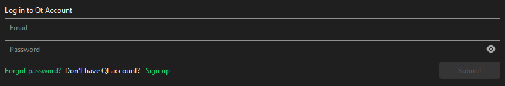
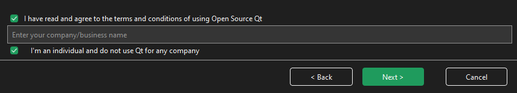
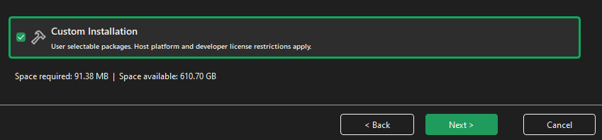

# Building ngs-bits from sources (Windows)

This manual assumes you have already retrieved a local copy of the [github respository](https://github.com/imgag/ngs-bits), as it has been described at [the main page](../README.md)

## Dependencies

First, we need to install Qt and some basic dependencies:

* Download and launch [Qt online installer](https://www.qt.io/download-qt-installer-oss). The online installer requires to have a Qt Account: you can create it free of charge [here](https://login.qt.io/login).
* During the installation you will need to login with your Qt credentials:

* The installer will also ask if you belong to an organization (as an individual developer, you may leave this field empty): 
* Select the `Custom installation`:

* Choose Qt 6.8.3 (select all components, since we will need them, especially the source code), build tools (MinGW 13.1.0 , CMake, Ninja, OpenSSL), Qt Creator (all components):

  
* The installation may take a while, its total duration mainly depends on your internet connection speed, since the installer downloads everything from the server (about 7GB).
* Download [MariaDB Connector C 64-bit](https://downloads.mariadb.com/Connectors/c/) (choose the latest available version, `*.msi` is the recommended option). Consider downlaoding the corresponding [MySQL Connector](https://dev.mysql.com/downloads/connector/cpp/), if you use MySQL as your database.
* Run the MariaDB Connector C 64-bit installer and choose the `Complete` setup type.
* Download and install [Git](https://git-scm.com/download/win) (it is needed to extract the repository version during the build process)
* **Optional:** To create plots in qcML files, install [WinPython](http://winpython.github.io/) and add the python directory to the PATH (it is inside the WinPython directory).

### htslib

[htslib](https://github.com/samtools/htslib) is a third-party library that provides functionality for NGS data formats like BAM or VCF.

We have pre-built `htslib` for Windows: `htslib 1.16.1` supports Qt 5 and `htslib 1.21` supports Qt 6. Corresponding Zip-archives can be found inside the repository: `ngs-bits\htslib\htslib_win_64_qt5.zip` and `ngs-bits\htslib\htslib_win_64_qt6.zip`. Depending on your Qt version, just unzip the contents of the ZIP archive into the `ngs-bits\htslib\` folder.

If you want to use a different version, e.g. when testing the latest version of htslib, there is a [manual on how to build htslib](build_htslib.md#windows) available.

### libxml2

[libxml2](https://github.com/GNOME/libxml2) is a library that allows to validate XML against a schema file. Unzip `ngs-bits\libxml2_win_64.zip` into `ngs-bits\`. Qt Creator will detect the library files and headers while compiling GSvar.

### MySQL plugin for Qt

The Qt distribution no longer contains a MySQL plugin.

You will need to have the source code of `Qt 6` and `MariaDB Connector C` installed on your Windows machine.

Qt community provides some [instructions](https://doc.qt.io/qt-6/sql-driver.html) on how to build the plugin. You may consult their page, if you encounter any issues. We, however, outline only the most essential parts in the current tutorial. For the majority of users it should be sufficient.

In the main Windows menu type `Qt 6.8.3 (MinGW 13.1.0 64-bit)` to open a `MinGW` terminal.

Assuiming you have installed Qt 6.8.3 into C:\Qt folder, run the following commands to build the database plugin (run them in `MinGW` terminal, not in the standard Windows CMD or PowerShell terminals):
	
	> cd C:\Qt\6.8.3\Src\qtbase\src\plugins\sqldrivers
	> set PATH=C:\Qt\Tools\CMake_64\bin;%PATH%
	> set PATH=C:\Qt\Tools\Ninja;%PATH%
	> mkdir C:\build
	> mkdir build-sqldrivers
	> cd build-sqldrivers
	> qt-cmake -G Ninja C:\Qt\6.8.3\Src\qtbase\src\plugins\sqldrivers -DMySQL_INCLUDE_DIR="C:\PROGRA~1\MariaDB\MARIAD~1\include" -DMySQL_LIBRARY="C:\PROGRA~1\MariaDB\MARIAD~1\lib\libmariadb.lib" -DCMAKE_INSTALL_PREFIX="C:\Qt\mariadb_plugin"
	> cmake --build .
	> cmake --install .
	> copy C:\Qt\mariadb_plugin\plugins\sqldrivers\qsqlmysql.* C:\Qt\6.8.3\mingw_64\plugins\sqldrivers\

Note: please pay attention to the spaces in the path names (e.g. for MariaDB Connector C), escape them properly (or copy the files to the folder that does not have spaces in its path).

Upon succesfull completion, `C:\mariadb_plugin` folder will have the binary files you need.

## Build

Before building the project, `Qt Creator` has to be set up correctly. Depending on your version, go to `Preference`(`Settings` or `Options`), in the search field at the top left corner type `Default build directory`. You will see the settings for the build dicrectory location (something like): `./build/%{Asciify:%{Kit:FileSystemName}-%{BuildConfig:Name}}`

Change the `Default build directory` to `../%{JS: Util.asciify("build-%{Project:Name}-%{Kit:FileSystemName}-%{BuildConfig:Name}")}`

We can now build ngs-bits:

* Build the ngs-bits tools using the QtCreator project file `src\tools.pro`. Make sure to build in release mode!  
* Then, build GSvar and other GUI tools using the *QtCreator* project file `src\tools_gui.pro`. Make sure to build in release mode!  

*Attention: Make sure to compile the [CRYPT_KEY](../GSvar/encrypt_settings.md) into the GSvar binary when using it in client-server mode. The CRYPT_KEY is used for a handshake between client and server.*

Now the executables can be found in the `bin` folder and can be executed from *QtCreator*.  
To use GSvar, it needs to be [configured](GSvar/configuration.md) first.

## Making the ngs-bits tools portable

To make the tools executable outside *QtCreator* and portable, you have to copy some files/folders of `GSvar` dependencies into the `bin` folder: `GSvar` will need `htslib`, `libxml2`, `sql drivers`, and some `qt libraries`. Currently `GSvar.exe` binary relies on the following DLLs: cppCORE.dll, cppGUI.dll, cppNGSD.dll, cppNGS.dll, cppVISUAL.dll, cppXML.dll, hts-3.dll, hts-3.lib, hts.dll.a, libbrotlicommon.dll, libbrotlidec.dll, libbz2-1.dll, libcppCORE.a, libcppGUI.a, libcppNGS.a, libcppNGSD.a, libcppVISUAL.a, libcppXML.a, libcrypto-3-x64.dll, libcurl-4.dll, libgcc_s_seh-1.dll, libhts.a, libiconv-2.dll, libidn2-0.dll, libintl-8.dll, liblzma-5.dll, libnghttp2-14.dll, libnghttp3-9.dll, libpsl-5.dll, libssh2-1.dll, libssl-3-x64.dll, libstdc++-6.dll, libsystre-0.dll, libtre-5.dll, libunistring-5.dll, libwinpthread-1.dll, libxml2-16.dll, libxml2.dll.a, libxml2.la, qsqlmysql.dll, Qt6Charts.dll, Qt6Core.dll, Qt6Gui.dll, Qt6Network.dll, Qt6OpenGL.dll, Qt6OpenGLWidgets.dll, Qt6PrintSupport.dll, Qt6Sql.dll, Qt6Svg.dll, Qt6Widgets.dll, Qt6Xml.dll, zlib1.dll

Rather than manually finding and copying these files, use `windeployqt.exe` utility that comes with Qt:

    > c:\Qt\6.8.3\mingw_64\bin\windeployqt.exe GSvar.exe

Adjust the command, based on your Qt version and the `GSvar.exe` file location. Sometimes `windeployqt.exe` may fail to get all of the dependencies. If it happens, the linbraries have to be copied manually.

The database connection has become more secure and now it requires a certificate authorities file to validate the database server certificates (only if the operating system has not been configured correctly already). It means that `GSvar` application connecting to AWS intances my need a `*.pem` file (e.g. `eu-central-1-bundle.pem`). Please visit the official [AWS RDS documentation](https://docs.aws.amazon.com/AmazonRDS/latest/UserGuide/UsingWithRDS.SSL.html) for more inforamtion.

Add `db_ssl_ca` parameter to your config and set its value to the CA bundle file path, for example `c:\\eu-central-1-bundle.pem`. Incorrect CA configuration will lead to TLS errors while connecting to the database server.

## Integration with IGV

For all the questions related to IGV, please see the [`IGV installation page`](GSvar\install_igv.md).
