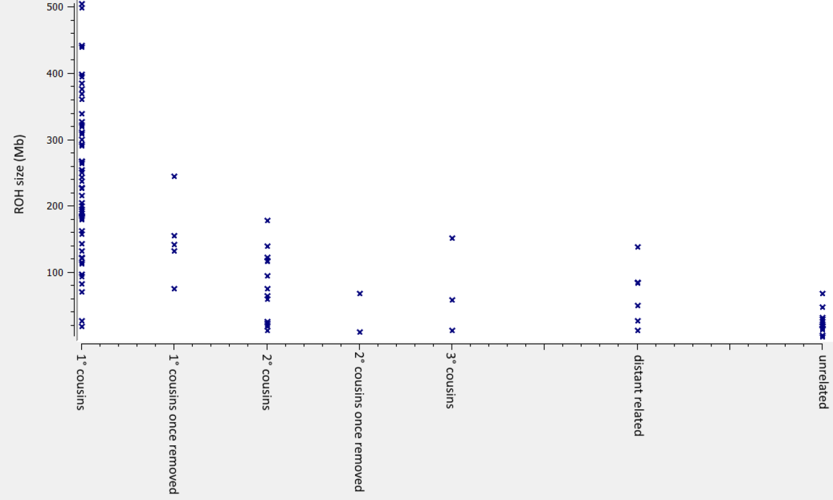

# RohHunter documentation

RohHunter is a tool for run of homozygosity (ROH) detection based on a variant list in VCF format.

RohHunter uses the allele frequency of variants to calculate the probability to see a ROH by chance.  
Allele frequency information can be annotated to the variant list via [Ensembl VEP](https://www.ensembl.org/info/docs/tools/vep/index.html).

## Algorithm description

These are steps the RohHunter algorithm performs:

1) Filter variants (markers) by quality to remove false genotype calls:  
   - Depth (default: &ge;20)  
   - Variant Q score (default: &ge;30)  
2) Determine raw stretches of homozygous markers
3) Assign probability to observe ROH by chance
   - based on allele frequency, e.g. using 1000g and gnomAD
4) Remove regions with low probability (default: <Q30)
5) Merge adjacent ROHs based on
   - distance in markers (default: &le;1 or &le;1% of ROH marker count) 
   - distance in bases (default: &le;50% of ROH base count)
6) Filter based on 
   - Number of markers (default: &ge;20)
   - Size (default: &ge;20Kb)

### Example

The following image visualizes the algorihtm and show how it copes with a genotyping error (at the start of exon 2):

 

## Using external allele frequency sources

Instead of using VEP annotations as source of allele frequency information, an external database of allele frequencies can be provided via the 'af_source' parameter.  
We suggest to use [gnomAD](https://gnomad.broadinstitute.org/downloads) in version 3.1 or higher as allele frequency database.

### Pre-processing of the external database

It is important to normalize the allele frequency database (and the variant list) so that most variants can be annotated with allele frequency:

1. Split multi-allelic variants to several rows, e.g. with [VcfBreakMulti](../VcfBreakMulti.md).
2. Left-align InDels e.g. with [VcfLeftNormalize](../VcfLeftNormalize.md).
3. Sort variants according to position, e.g. with [VcfStreamSort](../VcfStreamSort.md).

Finally, the allele frequency database has to be compressed with [bgzip](http://www.htslib.org/doc/bgzip.html) and index with [tabix](http://www.htslib.org/doc/tabix.html).

### Run-time using an external database

Using an exteral allele frequency database increases the run-time of the tool, since all variants have to be looked up in the database.

Our benchmarks show the following runtime increase when using the gnomAD genome database:

 - Exome (60K variants) from 4.3s (annotated) to ~100s.
 - Genome (4.8M variants) from 3.3m (annotated) to ~90m.

Thus, for genomes it is favorable to use annotated variants lists if available.

## ROHs and consanguinity

Many large ROHs in a child can be a indicator for consanguinity of the parents.  

This plot shows the distribution of the ROH sum for ROHs larger than 500kb in different sequencing approaches: **WGS** (Illumina TruSeq DNA PCR-Free), **WES** (Agilent SureSelect Human All Exon V7) and **long-read GS** (Oxford Nanopore Tech. Ligation Sequencing Kit V14):  
 

This plot shows the ROH sum of ROHs larger than 500kb for patients with different degrees of consanguinity:

 

It is pretty clear from the plots that a ROH size sum larger than 75Mb is a pretty good indicator for consanguinity of the parents.

## Help and ChangeLog

The RohHunter command-line help and changelog can be found [here](../RohHunter.md).

[back to ngs-bits](https://github.com/imgag/ngs-bits)
