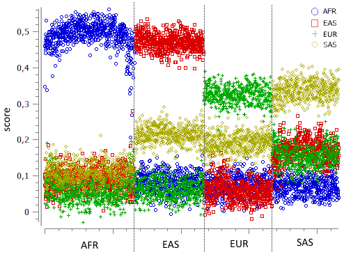

# SampleAncestry documentation

The ancestry estimation is based on correlating the sample variants with population-specific SNPs.  
For each population (AFR, EUR, SAS, EAS) the 1000 most informative exonic SNPs were selected for this purpose.  
A benchmark on the 1000 Genomes variant data assigned 99.81% of the samples to the correct population (2153 of 2157).

Due to different similarity between popultations, the expected scores differ depending on the ancestry of the sample of interest.  
This plot shows the score distribution on the 1000 Genomes data:

 

This table shows the score median and median average deviation determined from the 1000 Genomes data and used internally to assign a population:
<table>
  <tr>
    <th>population</th>
    <th>AFR median / mad</th>
    <th>EUR median / mad</th>
    <th>SAS median / mad</th>
    <th>EAS median / mad</th>
  <tr>
  <tr>
    <td>AFR</td>
    <td>0.5002 / 0.0291</td>
    <td>0.0553 / 0.0280</td>
    <td>0.1061 / 0.0267</td>
    <td>0.0895 / 0.0274</td>
  <tr>
  <tr>
    <td>EUR</td>
    <td>0.0727 / 0.0271</td>
    <td>0.3251 / 0.0252</td>
    <td>0.1922 / 0.0249</td>
    <td>0.0603 / 0.0264</td>
  <tr>
  <tr>
    <td>SAS</td>
    <td>0.0698 / 0.0264</td>
    <td>0.1574 / 0.0295</td>
    <td>0.3395 / 0.0291</td>
    <td>0.1693 / 0.0288</td>
  <tr>
  <tr>
    <td>EAS</td>
    <td>0.08415 / 0.0275</td>
    <td>0.06725 / 0.0269</td>
    <td>0.21495 / 0.0228</td>
    <td>0.47035 / 0.0242</td>
  <tr>
</table>

## Help and ChangeLog

The SampleAncestry command-line help and changelog can be found [here](../SampleAncestry.md).

[back to ngs-bits](https://github.com/imgag/ngs-bits)
