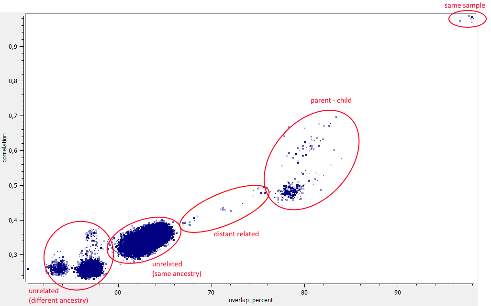

# SampleSimilarity documentation

SampleSimilarity calculates several metrics that measure sample similarity:

 * overlap: Percentage of variants that occur in both samples - not considering the genotype (only in VCF mode).
 * correlation: Correlation of variant genotypes.
 * ibd0: Percentage of variants with zero IBD, e.g. AA and CC (only in BAM mode).
 * ibd2: Percentage of variants with complete IBD, e.g. AA and AA.

Absolute cutoffs values for for same sample, parent-child pairs etc. do not exist, since they depend on ehtnicity, enrichment kit, etc.   
Example data for exome data (Agilent SureSelect Human All Exon V6) are shown here:

 

## Help and ChangeLog

The SampleSimilarity command-line help and changelog can be found [here](../SampleSimilarity.md).

[back to ngs-bits](https://github.com/imgag/ngs-bits)

