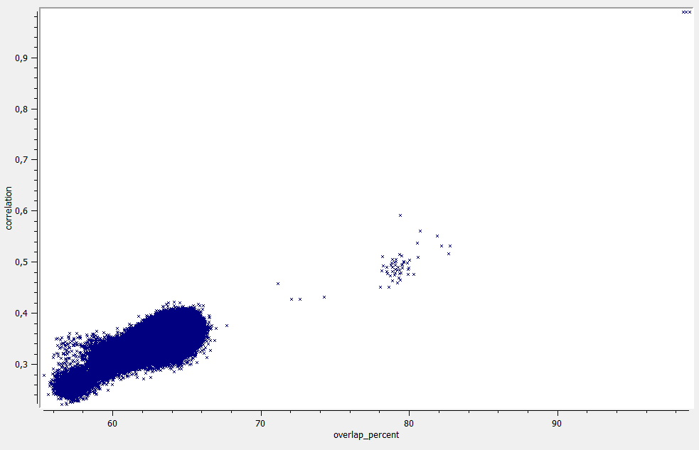
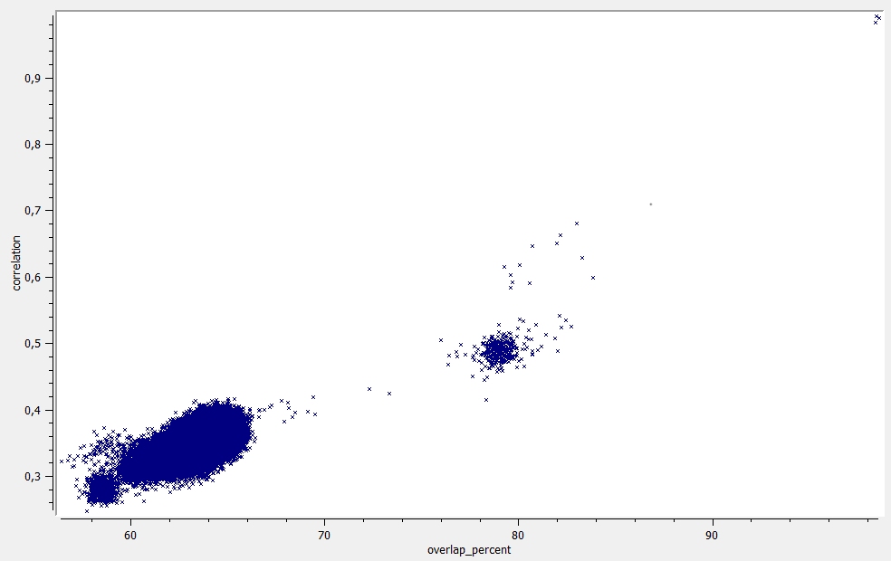

# SampleSimilarity documentation

SampleSimilarity calculates several metrics that measure sample similarity:

 * overlap: Percentage of variants that occur in both samples - not considering the genotype (only in VCF mode).
 * correlation: Correlation of variant genotypes.
 * ibs0: Percentage of variants with zero IBS, e.g. AA and CC (only in BAM mode).
 * ibs2: Percentage of variants with complete IBS, e.g. AA and AA.

Absolute cutoffs values for for same sample, parent-child pairs etc. do not exist, since they depend on ethnicity, enrichment kit, etc.
Example data for the *Agilent SureSelect Human All Exon V6 exome* kit is shown here:

 

For the *Agilent SureSelect Human All Exon V7* kit it look similar:

 

As well as for the *Illumina TruSeq DNA PCR-Free* kit:

 

## Help and ChangeLog

The SampleSimilarity command-line help and changelog can be found [here](../SampleSimilarity.md).

[back to ngs-bits](https://github.com/imgag/ngs-bits)
