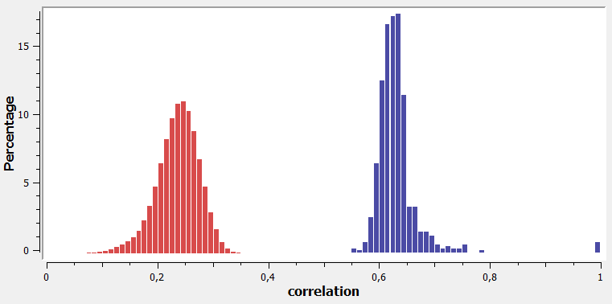
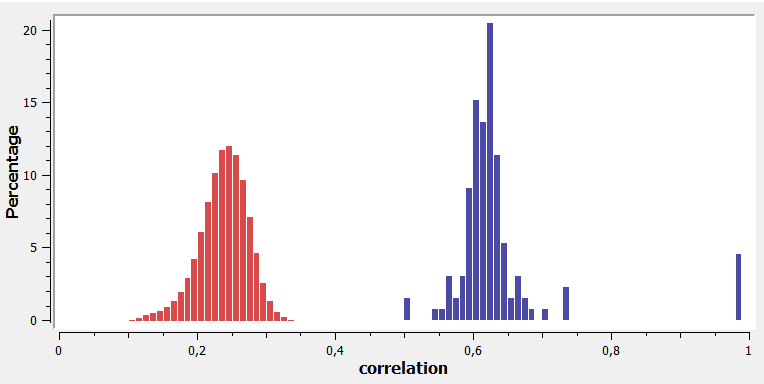

# SampleSimilarity documentation

SampleSimilarity calculates several metrics that measure sample similarity:

 * overlap\_percent: Overlap of the variant lists, i.e. percentage of variants found in both samples - not considering the genotype (only in VCF and GSvar mode).
 * correlation: Correlation of variant genotypes for variants found in both samples.
 * ibs0: Percentage of variants with zero IBS, e.g. AA and CC (only in BAM mode).
 * ibs2: Percentage of variants with complete IBS, e.g. AA and AA.

General cutoffs values for certain sample relations do not exist, as theses metrics depend on ethnicity, enrichment kit, etc.  
Still the metrics for exomes and genomes are quite similar, even when calcualted in different modes (details below).

## Example data: exome (VCF)

Example data for an exome samples (Agilent SureSelect Human All Exon V7) in VCF mode is shown here:

 

## Example data: exome (GSvar)

The score distribution in GSvar mode is very similar, although variants with [MODIFIER impact](https://www.ensembl.org/info/genome/variation/prediction/predicted_data.html) are ignored in this mode.

This plot shows the metrics of the same samples as above in GSvar mode:

 

## Example data: genome (VCF)

Example data for an genome samples (Illumina TruSeq DNA PCR-Free) in VCF mode is shown here:

 

## Example data: genome (GSvar)

The score distribution in GSvar mode is very similar, although variants with [MODIFIER impact](https://www.ensembl.org/info/genome/variation/prediction/predicted_data.html) are ignored in this mode.

This plot shows the metrics of the same samples as above in GSvar mode:

 

## Example data: exome (BAM)

The score distribution in BAM mode is different from VCF/GSvar mode.  
The reason is that all known SNPs are considered, even when both samples are wildtype.

This plot shows the correlation histogram of unrelated (red) and related (blue) samples:

 

## Example data: genome (BAM)

The score distribution in BAM mode is different from VCF/GSvar mode.  
The reason is that all known SNPs are considered, even when both samples are wildtype.

This plot shows the correlation histogram of unrelated samples:

 

## Help and ChangeLog

The SampleSimilarity command-line help and changelog can be found [here](../SampleSimilarity.md).

[back to ngs-bits](https://github.com/imgag/ngs-bits)
