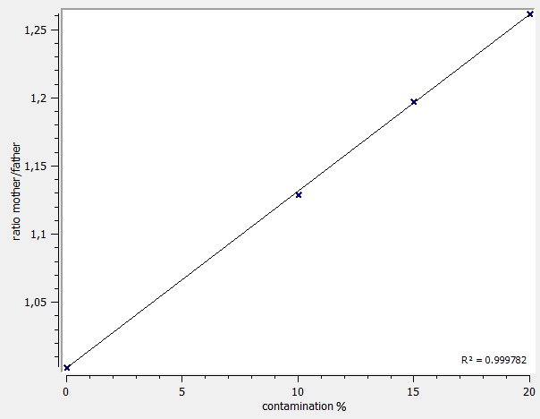

# TrioMaternalContamination documentation

The maternal contamination detection is based on variants passed on from father/mother to child.  
The assumption is that the fraction of heterozygous variants passed from father/mother to child should be the same.

The tool determines the heterozygous variants in father and mother.  
Then, the fraction of these variants passed on to the child is calculated.

If the fraction of variants passed on from the mother is much higher than from the father, a maternal contamination is likely.
The following plot shows a spike-in experment with 0 to 20% maternal contamination:

This plot shows that a contamination of 10% can reliably detected.

**Note:**  
TrioMaternalContamination default parameter are optimized for shallow genomes (3-5x).  
If used for regular genomes (30-50x), the parameters can be changed e.g. to `-min_depth 15 --min_alt_count 3`.

## Help and ChangeLog

The TrioMaternalContamination command-line help and changelog can be found [here](../TrioMaternalContamination.md).

[back to ngs-bits](https://github.com/imgag/ngs-bits)
