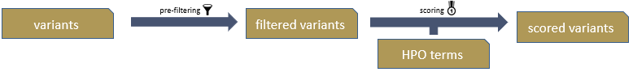

# VariantRanking documentation

The `VariantRanking` tool takes a small variant list of a single sample in [GSvar format](../../GSvar/gsvar_format.md) as produced by the [megSAP](https://github.com/imgag/megSAP/) analysis pipeline along with the patient's phenotype as a list of [HPO](https://hpo.jax.org/) terms.

## Algorithm description

The ranking algorithm consists of two main steps:

- pre-filtering variants 
- scoring the remaining variants

## Pre-filtering variants

The following main criteria are used to pre-filter for rare protein-altering variants:

<table border=1 style='border: 1px solid black; border-collapse: collapse;'>
	<tr>
		<th>criterion</th>
		<th>desciption</th>
	</tr>
	<tr>
		<td>Population allele frequency</td>
		<td>Allele frequency in gnomAD below 0.1% overall and for sub-populations AMR, AFR, EAS, SAS and NFE.</td>
	</tr>
	<tr>
		<td>IHDB count</td>
		<td>In-house database count with same genotype <= 10 - removes pipeline-specific artefacts</td>
	</tr>
	<tr>
		<td>Protein impact</td>
		<td>Impact is HIGH, MODERATE or LOW, i.e. no intronic or intergenic variants</td>
	</tr>
	<tr>
		<td>Variant quality</td>
		<td>QUAL>=20 and MAPQ>=20</td>
	</tr>
</table>

To include relevant intronic or intergenic variants the following additional criteria are applied:

<table border=1 style='border: 1px solid black; border-collapse: collapse;'>
	<tr>
		<th>criterion</th>
		<th>desciption</th>
	</tr>
	<tr>
		<td>Known pathogenic variants</td>
		<td>Keep variants filtered out above if they are flagged as known pathogenic variants in ClinVar or HGMD.</td>
	</tr>
	<tr>
		<td>Splicing variants</td>
		<td>Keep variants filtered out above if SpliceAI prediction is above 0.5.</td>
	</tr>
	<tr>
		<td>Population allele frequency</td>
		<td>Allele frequency in gnomAD below 1% overall (removes variants that are too frequent to be causal).</td>
	</tr>
</table>

## Scoring variants

Variants that pass the pre-filtering step are scored by summing up points addording to these criteria:

<table border=1 style='border: 1px solid black; border-collapse: collapse;'>
	<tr><th>criterion</th><th>points (dominant)</th><th>points (recessive)</th></tr>
	<tr><td>Protein impact (VEP)</td><td>3.0 for HIGH 2.0 for MODERATE 1.0 for LOW</td><td>3.0 for HIGH 2.0 for MODERATE 1.0 for LOW</td></tr>
	<tr><td>patient HPO term matches</td><td>1.0+sqrt(#matches) if there are matches</td><td>1.0+sqrt(#matches) if there are matches</td></tr>
	<tr><td>OMIM gene</td><td>1.0 if in OMIM gene</td><td>1.0 if in OMIM gene</td></tr>
	<tr><td>gnomAD allele frequency (overall)</td><td>1.0 if not in gnomAD 0.5 if below 0.01%</td><td>1.0 if not in gnomAD 0.5 if below 0.01%</td></tr>
	<tr><td>HGMD pathogenicity</td><td>0.5 if flagged as pathogenic 0.3 if flagged as likely pathogenic</td><td>0.5 if flagged as pathogenic 0.3 if flagged as likely pathogenic</td></tr>
	<tr><td>ClinVar pathogenicity</td><td>1.0 if flagged as pathogenic 0.5 if flagged as likely pathogenic</td><td>1.0 if flagged as pathogenic 0.5 if flagged as likely pathogenic</td></tr>
	<tr><td>Conservedness (pyloP, 100 way)</td><td>0.3 if bigger than 1.6</td><td>0.3 if bigger than 1.6</td></tr>
	<tr><td>Gene inheritance mode</td><td>0.5 if AD or XLD</td><td>0.5 if AR or XLR</td></tr>
	<tr><td>Gene gnomAD o/e LoF</td><td>0.5 if below 0.1</td><td>0.5 if below 0.1</td></tr>
	<tr><td>IHDB count (heterozygous)</td><td>1.0 if below 3 0.5 if below 6</td><td>-</td></tr>
	<tr><td>Genotype</td><td>-</td><td>1.0 if homozygous or two heterozygous hits in gene</td></tr>
</table>

Finally the variants are ranked according to the score sum.

## Benchmarking

For benchmarking, we selected solved cases from our diagnostics cohort with causal class 4 or class 5 variants. To benchmark the performance on different inheritance modes, we selected one heterozygous variant with dominant inheritance, or one homozygous variant with recessive inheritance, or two heterozygous variants with recessive inheritance (compound-heterozygous).

<table border=1 style='border: 1px solid black; border-collapse: collapse;'>
	<tr>
		<th>Inheritance mode</th>
		<th>#cases/variants</th>
		<th>Rank1</th>
		<th>Top3</th>
		<th>Top10</th>
	</tr>
	<tr>
		<td>dominant</td>
		<td>1280/1280</td>
		<td>86.56%</td>
		<td>94.30%</td>
		<td>98.13%</td>
	</tr>
	<tr>
		<td>recessive - homozygous</td>
		<td>524/524</td>
		<td>85.88%</td>
		<td>94.27%</td>
		<td>97.52%</td>
	</tr>
	<tr>
		<td>recessive - compound-heterozygous</td>
		<td>351/702</td>
		<td>85.43%</td>
		<td>94.00%</td>
		<td>97.14%</td>
	</tr>
</table>

**Note:**  
Since some of the variants were submitted to ClinVar by us, the benchmark above slightly over-estimates the performance.  
When leaving out the ClinVar-based critera, the performance is still very good:  
More than 78% of variants are on rank 1, more than 90% in the top 3, and more than 95% in the top 10.

## Help and ChangeLog

The VariantRanking command-line help and changelog can be found [here](../VariantRanking.md).

[back to ngs-bits](https://github.com/imgag/ngs-bits)
